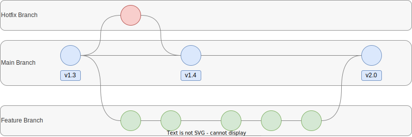

# Ops Tools & Principles

MLOps integrates a range of DevOps techniques and tools to enhance the development and deployment of machine learning models. By promoting cooperation between development and operations teams, MLOps strives to improve communication, enhance efficiency, and reduce delays in the development process. Advanced version control systems can be employed to achieve these objectives.

Automation plays a significant role in achieving these goals. For instance, CI/CD pipelines streamline repetitive tasks like building, testing, and deploying software. The management of infrastructure can also be automated, by using infrastructure as code to facilitate an automated provisioning, scaling, and management of infrastructure.

To enhance flexibility and scalability in the operational process, containers and microservices are used to package and deploy software. Finally, monitoring and logging tools are used to track the performance of deployed and containerized software and address any issues that arise.


## Containerization

Containerization is an essential component in operations as it enables deploying and running applications in a standardized, portable, and scalable way. This is achieved by packaging an application and its dependencies into a container image, which contains all the necessary code, runtime, system tools, libraries, and settings needed to run the application, isolated from the host operating system. Containers are lightweight, portable, and can run on any platform that supports containerization, such as Docker or Kubernetes.

All of this makes them beneficial compared to deploying an application on a virtual machine or traditionally directly on a machine. Virtual machines would emulate an entire computer system and require a hypervisor to run, which introduces additional overhead. Similarly, a traditional deployment involves installing software directly onto a physical or virtual machine without the use of containers or virtualization. Not to mention the lack of portability of both.

{ width=100% }

The concept of container images is analogous to shipping containers in the physical world. Like shipping containers can be loaded with different types of cargo, a container image can be used to create different containers with various applications and configurations. Both the physical containers and container images are standardized, just like blueprints, enabling multiple operators to work with them. This allows for the deployment and management of applications in various environments and cloud platforms, making containerization a versatile solution.

Containerization offers several benefits for MLOps teams. By packaging the machine learning application and its dependencies into a container image, reproducibility is achieved, ensuring consistent results across different environments and facilitating troubleshooting. Containers are portable which enables easy movement of machine learning applications between various environments, including development, testing, and production. Scalability is also a significant advantage of containerization, as scaling up or down compute resources in an easy fashion allows to handle large-scale machine learning workloads and adjust to changing demand quickly. Additionally, containerization enables version control of machine learning applications and their dependencies, making it easier to track changes, roll back to previous versions, and maintain consistency across different environments. To effectively manage model versions, simply saving the code into a version control system is insufficient. It's crucial to include an accurate description of the environment, which encompasses Python libraries, their versions, system dependencies, and more. Virtual machines (VMs) can provide this description, but container images have become the preferred industry standard due to their lightweight nature.
Finally, containerization facilitates integration with other DevOps tools and processes, such as CI/CD pipelines, enhancing the efficiency and effectiveness of MLOps operations.

<!---
```docker
FROM python:3.8.7-slim

RUN pip install PyMySQL==1.0.2 && \
    pip install psycopg2-binary==2.8.6 && \
    pip install mlflow[extras]==1.13.1

ENTRYPOINT ["mlflow", "server"]
```
-->


## Version Control

Version control is a system that records changes to a file or set of files over time, to be able to recall specific versions later. It is an essential tool for any software development project as it allows multiple developers to work together, track changes, and easily rollback in case of errors. There are two main types of version control systems: centralized and distributed.

1. Centralized Version Control Systems (CVCS) : In a centralized version control system, there is a single central repository that contains all the versions of the files, and developers must check out files from the repository in order to make changes. Examples of CVCS include Subversion and Perforce.
    
2. Distributed Version Control Systems (DVCS) : In a distributed version control system, each developer has a local copy of the entire repository, including all the versions of the files. This allows developers to work offline, and it makes it easy to share changes with other developers. Examples of DVCS include Git, Mercurial and Bazaar

Version control is a vital component of software development that offers several benefits. First, it keeps track of changes made to files, enabling developers to revert to a previous version in case something goes wrong. Collaboration is also made easier with version control, as it allows multiple developers to work on a project simultaneously and share changes with others. In addition, it provide backup capabilities by keeping a history of all changes, allowing you to retrieve lost files. Version control also allows auditing of changes, tracking who made a specific change, when, and why. Finally, it enables developers to create branches of a project, facilitating simultaneous work on different features without affecting the main project, with merging later.

Versioning all components of a machine learning project, such as code, data, and models, is essential for reproducibility and managing models in production. While versioning code-based components is similar to typical software engineering projects, versioning machine learning models and data requires specific version control systems. There is no universal standard for versioning machine learning models, and the definition of "a model" can vary depending on the exact setup and tools used. 

Popular tools such as Azure ML, AWS Sagemaker, Kubeflow, and MLflow offer their own mechanisms for model versioning. For data versioning, there are tools like Data Version Control (DVC) and Git Large File Storage (LFS). The de-facto standard for code versioning is Git. The code-versioning system Github is used for this project, which will be depicted in more detail in the following.

### Github

GitHub provides a variety of branching options to enable flexible collaboration workflows. Each branch serves a specific purpose in the development process, and using them effectively can help teams collaborate more efficiently and effectively.

{ width=100% }

*Main Branch:* The main branch is the default branch in a repository. It represents the latest stable version and production-ready state of a codebase, and changes to the code are merged into the main branch as they are completed and tested.
*Feature Branch:* A feature branch is used to develop a new feature or functionality. It is typically created off the main branch, and once the feature is completed, it can be merged back into the main branch.
*Hotfix Branch:* A hotfix branch is used to quickly fix critical issues in the production code. It is typically created off the main branch, and once the hotfix is completed, it can be merged back into the main branch.
*Release Branch:* A release branch is a separate branch that is created specifically for preparing a new version of the software for release. Once all the features and fixes for the new release have been added and tested, the release branch is merged back into the main branch, and a new version of the software is tagged and released.

### Git lifecycle

After a programmer has made changes to their code, they would typically use Git to manage those changes through a series of steps. First, they would use the command `git status` to see which files have been changed and are ready to be committed. They would then stage the changes they want to include in the commit using the command `git add <FILE-OR-DIRECTORY>`, followed by creating a new commit with a message describing the changes using `git commit -m "MESSAGE"`.

After committing changes locally, the programmer may want to share those changes with others. They would do this by pushing their local commits to a remote repository using the command `git push`.  Once the changes are pushed, others can pull those changes down to their local machines and continue working on the project by using the command `git pull`.

{ width=100% }

If the programmer is collaborating with others, they may need to merge their changes with changes made by others. This can be done using the `git merge <BRANCH-NAME>` command, which combines two branches of development history. The programmer may need to resolve any conflicts that arise during the merge.

If the programmer encounters any issues or bugs after pushing their changes, they can use Git to revert to a previous version of the code by checking out an older commit using the command git checkout. Git's ability to track changes and revert to previous versions makes it an essential tool for managing code in collaborative projects.

While automating the code review process is generally viewed as advantageous, it is still typical to have a manual code review as the final step before approving a pull or merge request to be merged into the main branch. It is considered a best practice to mandate a manual approval from one or more reviewers who are not the authors of the code changes.


## CI/CD

Continuous Integration (CI) and Continuous Delivery / Continuous Delivery (CD) are related software development practices that work together to automate and streamline the software development and deployment process of code changes to production. Deploying new software and models without CI/CD often requires a lot of implicit knowledge and manual steps.

{ width=100% }

1. *Continuous Integration (CI)*: is a software development practice that involves frequently integrating code changes into a shared central repository. The goal of CI is to catch and fix integration errors as soon as they are introduced, rather than waiting for them to accumulate over time. This is typically done by running automated tests and builds, to catch any errors that might have been introduced with new code changes, for example when merging a Git feature branch into the main branch.

2. *Continuous Delivery (CD)*: is the practice that involves automating the process of building, testing, and deploying software to a production-like environment. The goal is to ensure that code changes can be safely and quickly deployed to production. This is typically done by automating the deployment process and by testing the software in a staging environment before deploying it to production.

3. *Continuous Deployment (CD):* is the practice of automatically deploying code changes to production once they pass automated tests and checks. The goal is to minimize the time it takes to get new features and bug fixes into the hands of end-users. In this process, the software is delivered directly to the end-user without manual testing and verification. 

The terms *Continuous Delivery* and *Continuous Deployment* are often used interchangeably, but they have distinct meanings. Continuous delivery refers to the process of building, testing, and running software on a production-like environment, while continuous deployment refers specifically to the process of running the new version on the production environment itself. However, fully automated deployments may not always be desirable or feasible, depending on the organization's business needs and the complexity of the software being deployed. While continuous deployment builds on continuous delivery, the latter can offer significant value on its own.

CI/CD integrates the principles of continuous integration and continuous delivery in a seamless workflow, allowing teams to catch and fix issues early and quickly deliver new features to users. The pipeline is often triggered by a code commit. Ideally, a Data Scientist would push the changes made to the code at each incremental step of development to a share repository, including metadata and documentation. This code commit would trigger the CI/CD pipeline to build, test, package, and deploy the model software. In contrast to the local development, the CI/CD steps will test the model changes on the full dataset and aiming to deploy for production. 

CI and CD practices help to increase the speed and quality of software development, by automating repetitive tasks and catching errors early, reducing the time and effort required to release new features, and increasing the stability of the deployed software. Examples for CI/CD Tools that enable automated testing with already existing build servers are for example GitHub Actions, Gitlab CI/CD, AWS Code Build, or Azure DevOps

The following code snippet shows an exemplary GitHub Actions pipeline to test, build and push a Docker image to the DockerHub registry. The code is structured in three parts. 
At first, the environment variables are defined under `env`. Two variables are defined here which are later called with by the command `env.VARIABLE`. 
The second part defines when the pipeline is or should be triggered. The exampele shows three possibilites to trigger a pipelines, when pushing on the master branch `push`, when a pull request to the master branch is granted `pull_request`, or when the pipeline is triggered manually via the Github interface `workflow_dispatch`.
The third part of the code example introduces the actual jobs and steps performed by the pipeline. The pipeline consists of two jobs `pytest` and `docker`. The first represents the CI part of the pipeline. The run environment of the job is set up and the necessary requirements are installed. Afterward unit tests are run using the pytest library. If the `pytest` job was successful, the `docker` job will be triggered. The job builds the Dockerfile and pushes it automatically to the specified Dockerhub repository specified in `tags`. The step introduces another variable just like the `env.Variable` before, the `secrets.`. Secrets are a way by Github to safely store classified information like username and passwords. They can be set up using the Github Interface and used in the Github Actions CI using `secrets.SECRET-NAME`. 

\footnotesize
```yaml
name: Docker CI base

env:
  DIRECTORY: base
  DOCKERREPO: seblum/mlops-public

on:
  push:
    branches: master
    paths: $DIRECTORY/**
  pull_request:
    branches: [ master ]
  workflow_dispatch:

jobs:
  pytest:
    runs-on: ubuntu-latest
    defaults:
      run:
        working-directory: ./${{ env.DIRECTORY }}
    steps:
    - uses: actions/checkout@v3
    - name: Set up Python
      uses: actions/setup-python@v4
      with:
        python-version: '3.x'
    - name: Install dependencies
      run: |
        python -m pip install --upgrade pip
        pip install -r requirements.txt
        pip install pytest
        pip install pytest-cov
    - name: Test with pytest
      run: |
        pytest test_app.py --doctest-modules --junitxml=junit/test-results.xml --cov=com --cov-report=xml --cov-report=html
  docker:
    needs: pytest
    runs-on: ubuntu-latest
    steps:
      - name: Set up QEMU
        uses: docker/setup-qemu-action@v2
      - name: Set up Docker Buildx
        uses: docker/setup-buildx-action@v2
      - name: Login to DockerHub
        uses: docker/login-action@v2
        with:
          username: ${{ secrets.DOCKERHUB_USERNAME }}
          password: ${{ secrets.DOCKERHUB_TOKEN }}
      - name: Build and push
        uses: docker/build-push-action@v3
        with:
          file: ./${{ env.DIRECTORY }}/Dockerfile
          push: true
          tags: ${{ env.DOCKERREPO }}:${{ env.DIRECTORY }}
```
\normalsize

## Infrastructure as code 

Infrastructure as Code (IaC) is a software engineering approach that enables the automation of infrastructure provisioning and management using machine-readable configuration files rather than manual processes or interactive interfaces.

This means that the infrastructure is defined using code, instead of manually setting up servers, networks, and other infrastructure components. This code can be version controlled, tested, and deployed just like any other software code. It also allows to automate the process of building and deploying infrastructure resources, enabling faster and more reliable delivery of services, as well as ensuring to provide the same environment every time. It also comes with the benefit of an increased scalability, improved security, and better visibility into infrastructure changes.

It is recommended to utilize infrastructure-as-code to deploy an ML platform. Popular tools for implementing IaC are for example Terraform, CloudFormation, and Ansible. Chapter 6 gives a more detailed description and a tutorial on how to use Infrastructure as code using *Terraform*.
