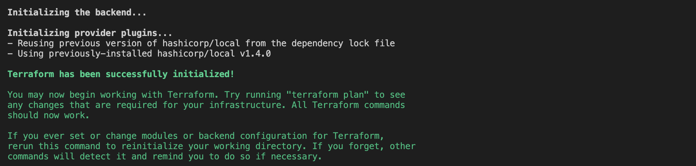

# Terraform

Terraform is an infrastructure as code (IaC) tool that allows you to build, change, and version infrastructure safely and efficiently. This includes both low-level components like compute instances, storage, and networking, as well as high-level components like DNS entries and SaaS features. [@hashicorpwebsite] (https://www.terraform.io/docs) 

IaC means using machine-readable definition files to manage and provision an entire IT infrastructure. This can automate the whole IT infrastructure and allows faster execution when configuring infrastructure, as well as allows a full traceability of the changes. Of the several IaC tools in the market right today, Terraform is a well known and established IaC tool.

Terraform is developed by HashiCorp, open-source, and allows to create both on-prem and cloud resources. There are several differend hundred providers that can be used with Terraform, such as Amazon Web Services (AWS), Azure, Google Cloud Platform (GCP), Kubernetes, Helm, GitHub, Splunk, DataDog, etc.

We want to use Terraform to create our ressource needed for Airflow in an automated way. 


## Prerequisites

To be able to follow through this tutorial, one needs to have the AWS CLI installed as well as the AWS credentials set up. Further, Terraform itself needs to be installed. Please refer to the corresponding sites. One can check its installation via `terraform version`.


## Basic usage

A Terraform project is basically just a set of files in a directory containing resource definitions of the cloud ressources to be created. Those Terraform files, denoted by the ending *.tf*, use Terraform's configuration language to define the specified resources. In the following example there are two definitions made: a *provider* and a *resource*. Later in this chapter we will dive deeper in the structure of the language. For now we only need to know this script is creating a file *hello.txt* which includes the text "Hello, Teraform". It's our Terraform version of Hello World!

```bash
provider "local" {
  version = "~> 1.4"
}
resource "local_file" "hello" {
  content = "Hello, Terraform"
  filename = "hello.txt"
}
```

### terraform init

When a project is run for the first time the terraform project needs to be initialized. This is done via the `terraform init` command. Terraform scans the project files in this step and downloads any required providers needed (more to providers in the following). In the given example this is the local procider.

```bash
terraform init — Initializes the working directory which consists of all the configuration files
```
 


### terraform validate

The `terraform validate` command checks the code for syntax errors. This is optional

```bash
terraform validate — Validates the configuration files in a directory
```
 

### terraform plan

The `terraform plan` command verifies what action Terraform will perform and what resources will be created. This step is basically a *dry run* of the code to be executed. It also returns the provided values and some permission attributes which have been set.

```bash
terraform plan — Creates an execution plan to reach a desired state of the infrastructure
```

 


### terraform apply

The command `Terraform apply` creates the resource specified in the .tf files. Initially the same output as in the `terraform plan` step is shown (hence its *dry run*). The output further states which resources are added, which will be changed, and which resources will be destroyed. After confirming the actions the resource creation will be executed.

If there have been made changes in the terraform ressources and those changes should be applied, `terraform apply` can be performed again as it is shown that resources will be changed.

```bash
terraform apply — Makes the changes in the infrastructure as defined in the plan
```

 


### terraform destroy

Finally, to destoy all created ressouces and to delete everything we did before, there is the `terraform destroy` command.

```bash
terraform destroy — Deletes all the old infrastructure resources
```

 


## Core Concepts

The following section will explain the core concepts and building blocks of Terraform.

### Providers

Terraform relies on plugins called providers to interact with cloud providers, SaaS providers, and other APIs. Each provider adds a set of resource types and/or data sources that Terraform can manage. For example the *aws* provider shown below allows to specify resources related to the aws cloud, such as S3 Buckets or EC3 instances.

Depending on the provider it is necessary to supply it with specific parameters. The aws provier e.g. needs the region as well as username and password. If nothing specified it will automatically pull these information from the *.aws/config* provided by the aws cli.
It is also a best practice to specify the version of the provider specified, as the providers are usually maintained and updated on a regular basis.

```bash
provider "aws" {
  region = "us-east-1"
}
```

### Resources

A Terraform resource is the core building block when working with IaC. It documents the syntax for declaring resources. This can be a *"local_file"* such as shown in the example above, or a cloud resource such as an *"ec2_instance"* on aws. The resource type is followed by the Terraform-name of the resource. Each specific customization and setting to the ressource is done within the resource specification. The style convention when writing Terraform code states that the resource name is named in lowercase as well as it should not repeat the resource type.

```bash
resource "aws_instance" "my-instance" {
  ami           = "ami-0ddbdea833a8d2f0d"
  instance_type = "t2.micro"
  
  tags = {
    Name = "my-instance"
    ManagedBy = "Terraform"
  }
}
```

### Data Sources

Data sources are “read-only” resources, meaning that it is possible to get information about existing data sources but it is not to create or change them. They are usually used to fetch parameters needed to create resources or generally for use elsewhere in Terraform configuration.

A typical example is shown below, the _aws_ami_ data source available in the AWS provider, which is used to recover attributes from an existing AMI. A data source called *"ubuntu”* is created that queries the AMI registry and returns several attributes related to the located image.

```bash
data "aws_ami" "ubuntu" {
  most_recent = true
  filter {
    name   = "name"
    values = ["ubuntu/images/hvm-ssd/ubuntu-trusty-14.04-amd64-server-*"]
  }
  filter {
    name   = "virtualization-type"
    values = ["hvm"]
  }
  owners = ["099720109477"] # Canonical
}
```

Data sources and their attributes can be used in other resource definitions by prepending the _data_ prefix to the attribute name. The following example used the *"aws_ami"* data source within an *"aws_instace"* resource.

```bash
resource "aws_instance" "web" {
  ami = data.aws_ami.ubuntu.id 
  instance_type = "t2.micro"
}
```

## State

A terraform state is file that stores all details about the resources and data created within a given context. Whenever we create a resource such as the *aws_instace*, terrafrom stores its identifier in the statefile. 

Providing information about already existing resources is the primary purpose of the statefile. When we apply the terraform script or whenever we modify our resource definitions, terraform knows what to create, change, or delete on the basis of the existing entries within the statefile. Keep in mind that everything we specifiy within terraform will be stored in the statefile so beware of sensitive information such as initial passwords.

Terraform uses the concept of a backend to store and retrieve it state files. The default backend is the local backend, which means to store the terraform state in a file in the project's root folder. However, we can also configure an alternative (remote) backend to store them elsewhere. The backend can be declared within a *terraform* block in the project files. The given example stores the statefile in an s3 bucket on aws. Keep in mind this needs access to an AWS account and also needs the aws provider to use with terraform.

```yaml
terraform {
  backend "s3" {
    bucket = "some-bucket"
    key = "some-storage-key"
    region = "us-east-1"
  }
}
```
    
## Modules

Terraform modules allow to reuse resources in multiple places throughout your project. They act as a container to package and reuse resource configurations. Much like in standard programming languages we can we organize our code across multiple files and packages instead of having one single file containing all the code. Wrapping one code into a module also allows to reuse it in different environments, for example when deploy a *dev* and a *prod* infrastructure. Both environments can reuse the code from the same module, just with different setting.

A module is a directory containing one or more resource definition files. Basically, when putting all our code in a single directory we have a module - yet only one. However,  terraform does not include subdirectories on its own as part of a module. Subdirectories must be called explicitly using a terraform *module*. In the example below we are referencing a module located in a *./network* subdirectory and passing a two parameters to it.

```yaml
module "network" {
  source = "./networking"
  create_public_ip = true
  environment = "prod"
}
```

Hence a module consists of a similar file structure as our root directory. We have a *main.tf* where all resources are specified as well as files for different data sources such as *variables.tf* and *outputs.tf*. Though, providers should be configured only in the root module and not in reusable modules.

```
root
│   main.tf
│   variables.tf
│   outputs.tf
│
└── networking
    │   main.tf
    │   variables.tf
    │   outputs.tf
```


### Input Variables

Each module can have multiple input variables. Input Variables serve as parameters for a Terraform module, so users can customize behavior without editing the source. In the previous networking example there are two input variables *create_public_ip* and *environment*. Input variables are specified in the *variables.tf* file.

```yaml
variable "instance_name" {
  type = string
  default = "awesome-instance"
  description = "Name of the aws instance to be created"
}
```
Each variable has a type (e.g. _string_, _map_, _set_, _boolen_) and may have a default value and description. Any variable that has no default value must be supplied using the arguments when calling a *module* reference. This means that variables defined at the root module need actual values assigned to so terraform will not fail. Terraform can do this by differenz resources.

* _-var_ command-line option
* _.tfvar_ files, using command-line options or scanning for well-known files/locations
* Environment variables starting with _TF\_VAR\__
* The variable's _default_ value, if present

Variables can be used in expressions using the *var.*-prefix such as shown in below example. We use the resource configuration of our previous example to create an aws instance, but this time we reference its name from a variable.

```yaml
resource "aws_instance" "awesome-instance" {
  ami           = "ami-0ddbdea833a8d2f0d"
  instance_type = "t2.micro"
  
  tags = {
    Name = var.instance_name
  }
}
```


### Output Variables

Similar to Input variables, a terraform module has output variables. As their name state, Output values return values of a Terraform module and are denoted in the *outputs.tf* file as expected. A module's consumer has no access to any resources or data created within the module itself. However, sometimes a modules attrivutes are needed for another module or resource. Output variables address this issue by exposing a defined subset of the created resources.

The example below defines an output value *instance_address* containing the IP address of an EC2 instance the we create with a module. Any module that reference this module can use the *instance_address* value by referencing it via *module.module_name.instance_address*

```yaml
output "instance_address" {
      value = aws_instance.awesome-instance.private_ip
      description = "Web server's private IP address"
    }
```

### Local Variables

Additionally to Input variables and output variables a module provides the use of local variables.
Local values are basically just a convenience feature to assign a shorter name to an expression and work like standard variables. This means theor scope is also limited to the module they are declared in. Using local variables reduces code repetitions which can be especially valuable when dealing with output variables from a module. 

```yaml
locals {
  vpc_id = module.network.vpc_id
}
module "network" {
  source = "./network"
}
module "service1" {
  source = "./service1"
  vpc_id = local.vpc_id
}
module "service2" {
  source = "./service2"
  vpc_id = local.vpc_id
}
```

## Additional tips & tricks

https://blog.gruntwork.io/terraform-tips-tricks-loops-if-statements-and-gotchas-f739bbae55f9
https://www.baeldung.com/ops/terraform-intro


### Loops

The _count_ and _for_each_ meta arguments allow us to create multiple instances of any resource. 

**for_each**

_for_each _accepts a list or map of values.

**counter**

The main difference between them is that _count_ expects a non-negative number

### Conditionals

if-statements

### Workspaces

Terraform workspaces allow us to keep multiple state files for the same project. When we run Terraform for the first time in a project, the generated state file will go into the _default_ workspace. Later, we can create a new workspace with the _terraform workspace new_ command, optionally supplying an existing state file as a parameter.


## Putting an example together

**Building a VPC with EC2 & S3**


# TODO
- [ ] when is the statefile created?
- [ ] make image for usage steps
- [ ] what is terraform {}
- [ ] disclaimer for aws cloud schreiben dass das wissen vorher benötigt wird
- [ ] disclaimer of cloud und netwerke schreiben