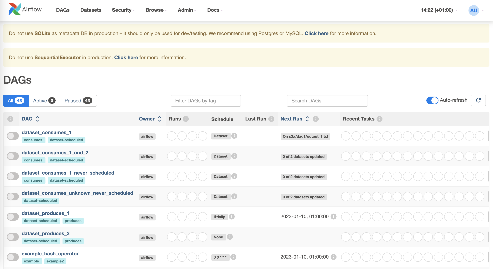
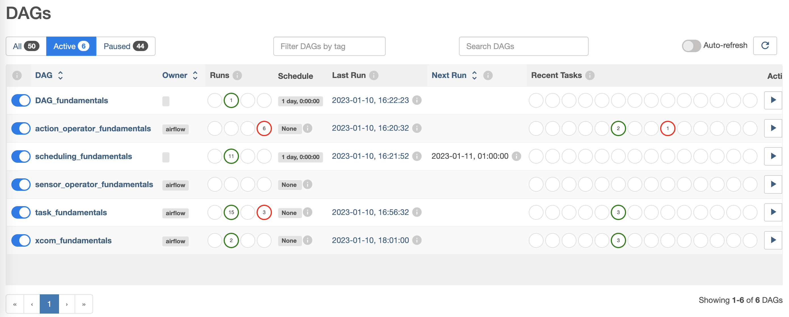

# Airflow

[Apache Airflow](https://github.com/apache/airflow) is an open-source platform to develop, schedule and monitor workflows. Airflow comes with a web interface to interact with and manage the state of workflows. The web user interface aims to make managing workflows as easy as possible and provides a good overview of each workflow over time and the ability to inspect logs and manage tasks, for example retrying a task in case of failure.



However, the philosophy of Airflow is to define workflows as code so coding will always be required. Thus, Airflow can also be referred to as a “Workflows as code”-tool that allows for a dynamic, extensible, and flexible management of its workflows.

The Airflow platform contains different operators to connect with many other technologies to easily extend and connect with new technologies. Being able to manage a workflow for all stages of the training of ML models, and the possibility to combine Airflow with other tools e.g. for the tracking of ML models (MLflow), make Apache Airflow a create tool to incorporate in a MLOps architecture.

The aim of this chapter is to give a tutorial on how to use Airflow from a user perspective, as well as give a short overview on its deployment. Airflow can be deployed in multiple ways, starting from a single process on a local machine to a distributed setup with multiple compute resources for large workflows in a production setting. A detailed description of what an Airflow deployment involves is shown in the section Airflow Infrastructure (TODO: section link). This tutorial is based based on the local installation of Airflow. Please refer to the prerequisits on what is needed to follow through.

## Prerequisites

TODO: local installation 

## Fundamental concepts

Airflow serves as a batch-oriented workflow orchestration plattform. Workflows vary in their levels of complexity and in general it is a term with various meaning depending on context. When working with Airflow, a workflow usually describes a set of steps to accomplish a given data engineering tasks, e.g. downloading files, copying data, filtering information, writing to a database, etc.

Exemplary workflows or use cases might be for example to set up a ETL pipeline that extracts data from multiple sources, the transformation of the data, as well as loading them into a machine learning model. Even the training itself of a ML model can triggered via Airflow. Another workflow step might involve the generation of a report or backups. 

Even though Airflow can implement programs from any language, the workflows are written and defined as Python code. Airflow allows to access them via code, command-line, or via web interface. Writing workflows in code allows to store the in version control to ensure roll backs to previous versions as well as to develop a workflow with a team of developers simultaneously. It also allows to include further DevOps principles such as testing and validating the codes functionality.

### DAGs

A workflows in Airflow is implemented as a DAG, a *Directed Acyclic Graph*. A *graph* describes the actual set of components of a workflow. It is *directed* because it has an inherent flow representing dependencies between its components. It is *acyclic* as it does not loop or repeat.

An Airflow workflow is just a Python script that defines an Airflow DAG object as code. The DAG object is needed to nest the separate tasks of a workflow into. A workflow specified in code, e.g. python, is often also referred to as a *pipeline*. This terminology can be used synonymosly when working with Airflow. The following code-snipped depicts how to define a DAG object in code. The `dag_id` string is a unique identifier to a DAG. The `default_args` dictionary consists of additional parameters to be specified. The snippet below only shows two of them, there are a lot more though, which can also be seen here (TODO insert link)

```python
from airflow.models import DAG
from pendulum import datetime

# Using extra arguments allows to customize in a clear structure
# e.g. when setting the time zone in a DAG.
default_args = {
    'start_date': datetime(2023, 1, 1, tz="Europe/Amsterdam"),
    'schedule_interval': 'None'
}

example_dag = DAG(
    dag_id='DAG_fundamentals',
    default_args=default_args
)
```

A workflow can be run either via the web interface or via the command line interface. 




The following command shows who to list the active DAGs from the directory.

TODO: check whether commands are necessary
```bash
# Initialize the database tables
airflow db init

# Print the list of active DAGs
airflow dags list
```

People sometimes think of the DAG definition file as a place where they can do some actual data processing - that is not the case at all! The script’s purpose is to define a DAG object. It needs to evaluate quickly (seconds, not minutes) since the scheduler will execute it periodically to reflect the changes if any. (rephrase - cause its copied).
A DAG usually consists of multiple steps it runs through, also names as tasks. Tasks themselves consist of operators. This will be outlined in the following subsections.


### Operators

An Operator represents a single predefined task in a workflow and are basically a unit of work for Airflow to complete. Operators usually run independently and generally do not share any information. There are different categories of operators to perform different tasks, for example *Action operators*, *Transfer operators*, or *Sensors*. 
Action operators executes a basic task based on the operators specifications, for example the `BashOperator`, the `PythonOperator`, or `KubernetesPodOperator`. The operator names already suggest what kind of executions they provide. Transfer operators are designed to transfer data from one place to another, for example to copy data from one cloud bucket to another. Those operators are often stateful, which means the downloaded data is first stored locally and the uploaded to the destination storage. This different principle of execution defines them as an own category of operator. Finally, Sensors are a special subclass of operators that are triggered when an external event is happening. They are further outlined in the subsection (TODO reference to own section).

The `PythonOperator` is actually a deprecated function and now uses the `@task`-decorator of *Taskflow* to define work in a more Pythonic context and turn a python function into an Airflow task. Yet, it still works in (TODO inser airflow version) Airflow v2 and is still a good example on how operators work.


#### Action Operators

**BashOperator**

As its name suggests, the `BashOperator` executes commands in the bash shell. 

```python
from airflow.operators.bash_operator import BashOperator

bash_task = BashOperator(
    task_id='bash_example',
    bash_command='echo "Example Bash!"',
    dag=action_operator_fundamentals
)
```

**PythonOperator**

The `PythonOperator` expects a python callable. Airflow passes a set of keyword arguments to the function and takes the `op_kwargs` dictionary to pass them to the callable.

```python
from airflow.operators.python_operator import PythonOperator

def sleep(length_of_time):
    time.sleep(length_of_time)

sleep_task = PythonOperator(
    task_id='sleep',
    python_callable=sleep,
    op_kwargs={'length_of_time': 5},
    dag=action_operator_fundamentals
)
```

**EmailOperator**

The `EmailOperator` allows to send predefined emails from an Airflow DAG run. This could be use for example to notify if a workflow was successfull or not. The `EmailOperator` does require the Airflow system to be configured with email server details.

```python
from airflow.operators.email_operator import EmailOperator

email_task = EmailOperator(
    task_id='email_sales_report',
    to='sales_manager@example.com',
    subject='automated Sales Report',
    html_content='Attached is the latest sales report',
    files='latest_sales.xlsx',
    dag=action_operator_fundamentals
)
```

#### Transfer Operators

**GoogleApiToS3Operator**

The `GoogleApiToS3Operator` makes requests to any Google API that supports discovery and uploads its response to AWS S3. The example below loads data from Google Sheets and saves it to an AWS S3 file.

```python
from airflow.providers.amazon.aws.transfers.google_api_to_s3 import GoogleApiToS3Operator

google_sheet_id = <GOOGLE-SHEET-ID >
google_sheet_range = <GOOGLE-SHEET-RANGE >
s3_destination_key = <S3-DESTINATION-KEY >

task_google_sheets_values_to_s3 = GoogleApiToS3Operator(
    task_id="google_sheet_data_to_s3",
    google_api_service_name="sheets",
    google_api_service_version="v4",
    google_api_endpoint_path="sheets.spreadsheets.values.get",
    google_api_endpoint_params={
        "spreadsheetId": google_sheet_id, "range": google_sheet_range},
    s3_destination_key=s3_destination_key,
)
```

**DynamoDBToS3Operator**

The `DynamoDBToS3Operator` copies the content of an AWS DynamoDB table to an AWS S3 bucket. It is also possible to specifiy criteria such as `dynamodb_scan_kwargs` to filter the transfer to only replicate records according to criteria.

```python
from airflow.providers.amazon.aws.transfers.dynamodb_to_s3 import DynamoDBToS3Operator

table_name = <TABLE-NAME >
bucket_name = <BUCKET-NAME >

backup_db = DynamoDBToS3Operator(
    task_id="backup_db",
    dynamodb_table_name=table_name,
    s3_bucket_name=bucket_name,
    # Max output file size in bytes.  If the Table is too large, multiple files will be created.
    file_size=20,
)
```

**AzureFileShareToGCSOperator**

The `AzureFileShareToGCSOperator` transfers files from the Azure FileShare to the Google Storage. Even though the storage systems are quite similar, this operator is be beneficial when the cloud provider needs to be switched. The `share_name`-parameter denotes the Azure FileShare share name to transfer files from. Similarly, the `dest_gcs`specifies the destination bucket on the Google Cloud. An example operator call could look like this:

```python
from airflow.providers.google.cloud.transfers.azure_fileshare_to_gcs import AzureFileShareToGCSOperator

azure_share_name = <AZURE-SHARE-NAME >
bucket_name = <BUCKET-NAME >
azure_directory_name = <AZURE-DIRECTORY-NAME >

sync_azure_files_with_gcs = AzureFileShareToGCSOperator(
    task_id="sync_azure_files_with_gcs",
    share_name=azure_share_name,
    dest_gcs=bucket_name,
    directory_name=azure_directory_name,
    replace=False,
    gzip=True,
    google_impersonation_chain=None,
)
```


#### Sensors

A *sensor* is a special subclass of an operator that is triggered when an external event is happening or a certain condition is be true. Such conditions are for example the creation of a file, an upload of a database record, or a certain response from a web request.

It is also possible to specify how often check the condition to be true, which is done by different arguments. The `mode`argument sets how to check for a condition. `mode='poke'` states to run a task repeatedly until it is successful (this is the default), whereas `mode='reschedule'` gives up a task slot and tries again later.
Simultaneously, the `poke_interval` defines how long a sensor has to wait between checks, and `timeout`defines how long to wait before letting a task fail. 

Below example show a `FileSensor` that checks the creation of a file with a `poke_interval` defined. A workflow is defined with its dependencies as well to give an exemplary idea of how and when to use sensors.
```python
from airflow.contrib.sensors.file_sensor import FileSensor

file_sensor_task = FileSensor(task_id='file_sense',
                              filepath='salesdata.csv',
                              poke_interval=30,
                              dag=sensor_operator_fundamentals
                              )
```

Other sensors are for example:
* `ExternalTaskSensor` - waits for a task in another DAG to complete
* `HttpSensor` - Requests a web URL and checks for content
* `SqlSensor` - Runs a SQL query to check for content

TODO: check out https://medium.com/@komal1491/airflow-external-sensor-a7e999ecadfd

###  Tasks

To use an operator in a DAG it needs to be instantiated as a task. Tasks determine how to execute an operator’s work within the context of a DAG. The concepts of a *Task* and *Operator* are actually somewhat interchangeable as each task is actually a subclass of Airflow’s `BaseOperator`. However, it is useful to think of them as separate concepts. Tasks are Instances of operators and are usually assigned to a variable on Python. The following code instantiates the `BashOperator` to two different variables `t1` and `t2`.

TODO: what is `depends_on_past` for?

```python
task_1 = BashOperator(
    task_id="print_date",
    bash_command="date",
    dag=task_fundamentals
)

task_2 = BashOperator(
    task_id="set_sleep",
    depends_on_past=False,
    bash_command="sleep 5",
    retries=3,
    dag=task_fundamentals
)

task_3 = BashOperator(
    task_id="print_success",
    depends_on_past=False,
    bash_command='echo "Success!"',
    dag=task_fundamentals
)
```

Tasks can be referred to by their task_id either using the web interface or using the CLI within the airflow tools. 

```bash
# Run a single task with the following command
airflow run <dag_id> <task_id> <start_date>

# Run tasks locally for testing
airflow tasks test <dag_id> <task_id> <input-parameter>

# Testing the task print_date
airflow tasks test task_fundamentals print_date 2015-06-01

# Testing the task sleep
airflow tasks test task_fundamentals sleep 2015-06-01
```

`airflow tasks test` runs task instances locally, outputs their log to stdout (on screen), does not bother with dependencies, and does not communicate state (running, success, failed, …) to the database. It simply allows testing a single task instance. Same goes with `airflow dags test`


#### Task dependencies

A machine learning or data workflow usually has a specific order in which its tasks need to run. It is possible to define a specific order of task completion within Airflow. The order is defined by using task dependencies that are either referred to as upstream or downstream tasks. In Airflow 1.8 and later, this can be defined using the bitshift operators within python:

* **>>** - or the upstream operator (before)
* **<<** - or the downstream operator (after)

An exemplary code and chaining examples of tasks would look like this:

```python
# Simply chained dependencies
task_1 >> task_2 >> task_3
```


```python
# Mixed dependencies
task_1 >> task_3 << task_2

# which is similar to
task_1 >> task_3
task_2 >> task_3

# or
[task_1, task_2] >> task_3

```


```python
# It is also possible to define dependencies with
task_1.set_downstream(task_2)
task_3.set_upstream(task_1)
```


```python
# It is also possible to mix it completely wild
task_1 >> task_3 << task_2
task_1.set_downstream(task_2)
```


It is possible to list all tasks within a DAG using the cli. Below commands show two approaches.

```bash
# Prints the list of tasks in the "task_fundamentals" DAG
airflow tasks list task_fundamentals

# Prints the hierarchy of tasks in the "task_fundamentals" DAG
airflow tasks list task_fundamentals --tree
```

Each defined tasks in a DAG runs on a different worker. This means that they cannot cross communicate between tasks naturally. To achieve cross communication it is possible to use XComs.
Tasks are also not guaranteed to run in the same location/environment. It may require an extensive use of environment variables to achieve this. Can be difficult to run tasks with elevated privileges.


### Scheduling

A workflow can be run either manually triggered or on a scheduled basis. Each DAG maintains a state for each workflow and the tasks within the workflow, and specifies whether it is *running*, *failed*, or a *success*. 

The Airflow scheduler monitors all DAGs and tasks, and triggers those task instances whose dependencies have been met. Airflow scheduling is designed to run as a persistent service in an production environment. Execution of `airflow scheduler` will use the configuration specified in `airflow.cfg` and start the service.

A scheduled tasks needs several attributes specifies. When looking at the first example of how to define a DAG we can see that we already defined the attributes `start_date`, and `schedule_interval`. We can also add optional attributes such as `end_date`, and `max_tries`.

```python
from airflow.models import DAG

default_args = {
    'start_date': '2023-01-01',
    # (optional) when to stop running new DAG instances
    'end_date': '2023-01-01',
    # (optional) how many attempts to make
    'max_tries': 3,
    'schedule_interval': '@daily'
}

example_dag = DAG(
    dag_id='scheduling_fundamentals',
    default_args=default_args
)
```


### XCom

XCom (short for “cross-communication”) is a mechanism that allows information passing between tasks in a DAG. This is beneficial as by default tasks are isolated within Airflow and ma run on entirely different machines.

An XCom is identified by a key-value pair stored in the Airflow Metadata Database. This means everytime we interact with an XCom we interact with the Metadata Database. The `key` of an XCom is basically its name and consists of a tuple (`dag_id`, `task_id`, `execution_date`,`key`). *key* within the XComs name denoted the name of the stored data and is a configurable string (by default it’s `return_value`). The XComs `value` is a json serializable and is only designed for small amounts of data, depending on the attache metadata database (e.g. MySQL provides max 48Kb, PostgreSQL 1Gb - TODO: check data).
The goal is not to use XComs to pass large values like dataframes. This means that the XCom purpose is to store metadata and not the data itself. 
If there is the need to pass a big data frame from *task_a* to *task_b*, the data is stored in a persistent storage solution (bucket, or database) between those two tasks. 
XComs are explicitly pushed and pulled to/from their storage using the `xcom_push` and `xcom_pull` methods.
This means that *task_a* pushes the data to storage and writes to the XCom table where the data is stored and can be found (e.g. a AWS S3 URI). Afterward, *task_b* can access this information and retrieve the data from the external storage.

Below example shows its mechanics. While the `push_*`-methods upload the XCom, the `pull`-method downloads information from XCom. However, when looking at the `push` one can see a difference in their functionality. The method `push_by_returning` uses the operators' auto-push functionality that pushes their results into an default XCom key (the default called `return_value`). This allows to use only pythons return function. The auto-push functionality is enabled by setting the `do_xcom_push` argument to `True`, which it is by default ( `@task` functions do this as well).

To push an XCom with a specific key, the `xcom_push`-method needs to be called explicitly. In order to access the `xcom_push` one needs to access the task instance (ti) object. With the PythonOperator we can access it by passing the parameter `"ti"` to the python callable function (or kwargs). Its usage can be seen in the `push` method where also a custom key is given to the XCom.
Similarly, the `puller` function uses the `xcom_pull` method to pull the previously pushed values from the metadata databes.

```python
from airflow.models import DAG
from pendulum import datetime
from airflow.operators.python_operator import PythonOperator


xcom_fundamentals = DAG(
    dag_id='xcom_fundamentals',
    start_date=datetime(2023, 1, 1, tz="Europe/Amsterdam"),
    schedule_interval=None
)

# DAG definition etc.
value_1 = [1, 2, 3]
value_2 = {'a': 'b'}

def push(**kwargs):
    """Pushes an XCom without a specific target"""
    kwargs['ti'].xcom_push(key='value from pusher 1', value=value_1)

def push_by_returning(**kwargs):
    """Pushes an XCom without a specific target, just by returning it"""
    # Airflow does this automatically as auto-push is turned on.
    return value_2

def puller(**kwargs):
    """Pull all previously pushed XComs and check if the pushed values match the pulled values."""
    ti = kwargs['ti']

    # get value_1
    pulled_value_1 = ti.xcom_pull(key=None, task_ids='push')

    # get value_2
    pulled_value_2 = ti.xcom_pull(task_ids='push_by_returning')

    # get both value_1 and value_2 the same time
    pulled_value_1, pulled_value_2 = ti.xcom_pull(
        key=None, task_ids=['push', 'push_by_returning'])

    print(f"pulled_value_1: {pulled_value_1}")
    print(f"pulled_value_2: {pulled_value_2}")


push1 = PythonOperator(
    task_id='push',
    # provide context is for getting the TI (task instance ) parameters
    provide_context=True,
    dag=xcom_fundamentals,
    python_callable=push,
)

push2 = PythonOperator(
    task_id='push_by_returning',
    dag=xcom_fundamentals,
    python_callable=push_by_returning,
    # do_xcom_push=False
)

pull = PythonOperator(
    task_id='puller',
    # provide context is for getting the TI (task instance ) parameters
    provide_context=True,
    dag=xcom_fundamentals,
    python_callable=puller,
)

# push1, push2 are upstream to pull
[push1, push2] >> pull
```


### Executor

How and where are the DAG workflows actually run? This is where executors come into play - they run tasks. An executor defines where and how the Airflow tasks should be executed. This crucial component of Airflow can be configured by the user and should be chosen to fit the users specific needs. There are several different executors, each handleing the run of a task a bit differently. This also relies on the underlying infrastructure Airflow is build on.

+ The `LocalExecutor`executes each task in a separate processe on a single machine. It’s the only non-distributed executor which is production ready and works well in relatively small deployments. If you installed Airflow as show above in the prerequisites, you will use this executor. 
+ In contrast, the `CeleryExecutor` uses under the hood the Celery queue system that allows users to deploy multiple workers that read tasks from the broker queue (Redis or RabbitMQ) where tasks are sent by scheduler. This enables Airflow to distribute tasks between many machines and allows users to specify what task should be executed where. This is for example useful for routing compute-heavy tasks to more resourceful workers and is the most popular production executor.
+ The `KubernetesExecutor` is another widely used production-ready executor and works similarly to the `CeleryExecutor`. As the name allready suggests it requires an underlying Kubernetes cluster that enables Airflow to spawn a new pod to run each task. Even though this is a robust method to account for machine or pod failure, the additional overhead in creation can be problematic for short running tasks.
+ The `CeleryKubernetsExecutor` uses both, the `CeleryExecutor` and `KubernetesExecutor` (as the name already says). It allows to distinguish whether a particular task should be executed on kubernetes or routed to the celery workers. This way users can take full advantage of horizontal auto scaling of worker pods and to delegate computational heavy tasks to kubernetes.
+ An additional `DebugExecutor`works as a is a debug executor. Its main purpose is to debug DAGs locally. It’s the only executor that uses a single process to execute all tasks.

TODO: add SequentialExecutor


### Taskflow

Defining a DAG and using operators as shown in the previous sections is the classic approach to define a workflow in Airflow. However, the TaskFlow API was introduced as part of Airflow 2.0 which allows a to define work in a more pythonic way using decorators. Dags and Tasks are created using the `@dag`or `@task` decorators. The function name itself acts as the unique identifier for the DAG or task respectively.

All of the processing in the new TaskFlow DAG is similar to the traditional paradigm of Airflow, but it is all abstracted from the developers and allows them to focus on the code. Task dependencies are automatically generated within TaskFlows based on the functional invocation of tasks.

Defining a workflow of an ETL-pipeline using the TaskFlow paradigm is shown in belows example. The pipeline invokes an *extract* task, sends the ordered data to a *transform* task for summarization, and finally invokes a *load* task with the previously summarized data. You will see the Taskflow workflow contrasts with Airflow's traditional paradigm in several ways.

```python
import json
import pendulum
from airflow.decorators import dag, task

# Specify the dag using @dag
# The Python function name acts as the DAG identifier
# (see also https://airflow.apache.org/docs/apache-airflow/stable/tutorial_taskflow_api.html)

@dag(
    schedule=None,
    start_date=pendulum.datetime(2021, 1, 1, tz="UTC"),
    catchup=False,
    tags=["example"],
)
def taskflow_api_fundamentals():
    # set a task using @task
    @task()
    def extract():
        data_string = '{"1001": 301.27, "1002": 433.21, "1003": 502.22}'
        order_data_dict = json.loads(data_string)
        return order_data_dict

    @task(multiple_outputs=True)
    def transform(order_data_dict: dict):
        total_order_value = 0
        for value in order_data_dict.values():
            total_order_value += value
        return {"total_order_value": total_order_value}

    @task()
    def load(total_order_value: float):
        print(f"Total order value is: {total_order_value:.2f}")

    # task dependencies are automatically generated
    order_data = extract()
    order_summary = transform(order_data)
    load(order_summary["total_order_value"])

# Finally execute the DAG
taskflow_api_fundamentals()
```

Even the passing of data between tasks which could be running on different workers is all handled by Airflow and there is no need to use XComs. All of the XCom usage passing data between tasks is abstracted away. However, XCom is still used behind the scenes which allows to view them in the Airflow UI to debug or monitor your DAG. Have a look at belows example to compare the `transform` function using the traditional Airflow and the TaskFlow API.

```python
def transform(**kwargs):
    ti = kwargs["ti"]
    extract_data_string = ti.xcom_pull(task_ids="extract", key="order_data")
    order_data = json.loads(extract_data_string)

    total_order_value = 0
    for value in order_data.values():
        total_order_value += value

    total_value = {"total_order_value": total_order_value}
    total_value_json_string = json.dumps(total_value)
    ti.xcom_push("total_order_value", total_value_json_string)
```

As one can see, using Taskflow is an easy approach to workflowing in Airflow. It takes away a lot of worries when it comes to building pipelines and allows for a flexible programing experience using decorators. It allows for several more functionalities , such as for example reusing decorated tasks in multiple DAGs and overriding the task parameters such as the `task_id`, etc. 
However, even though Taskflow allows a smooth way of developing workflows, it is beneficial to learn the traditional Airflow API to understand the fundamental concepts of how to create a workflow. The following section will build up on that knowledge and depict a full machine learning workflow as an example.


## Exemplary ML workflow

Please refer to the previous section. This involves everything

```python
# build dag that includes everything from before
```


## Deploying Airflow

Before Data Scientists and Machine Learning Engineers can utilize the power of Airflow Workflows, Airflow obviously needs to be set up and deployed. There are multiple ways an Airflow deployment can take place. It can be run either on a single machine or in a distributed setup on a cluster of machines. As stated in the prerequisites for this tutorial we set up Airflow locally on a single machine to introduce you on how to work with airflow. Although Airflow can be run on a single machine, it is beneficial to deploy it as a distributed system to utilize its full power.

### Airflow as a distributed system

Airflow consists of several separate parts. While this separation is somewhat simulated on a local deployment, each several part of Airflow can be deployed separately when deploying Airflow in a distributed manner. This comes with benefits of safety, security, and reliability (TODO check terms).

An Airflow deployment generally consists of five different compontens:

* **Scheduler:** The schedules handles triggering scheduled workflows and submitting tasks to the executor to run.
* **Executor:** The executor handles running the tasks themselves. In a local installation of Airflow, the tasks are run by the executor itself, whereas in a production ready deployment if Airflow the executor pushes the task execution to separate worker instances.
* **Webserver:** The webserver provides the user interface of Airflow we have seen before that allows to inspect, trigger, and debug DAGs and tasks.
* **DAG Directory:** The DAG directory is a directory that contains the DAG files which are read by the scheduler and executor.
* **Metadata Database:** The metadata database is used to store data of the scheduler, executor, and the webserver, such as scheduling- or runtime, and user settings.

The following graphs shows how the components build up the Airflow architecture.


### Scheduler 

The scheduler is basically the brain and heart of Airflow. It handles triggering and scheduling of workflows as well as submitting tasks to the executor to run. To be able to do this, the scheduler is responsible to parse the DAG files from the *DAG directory*, manage the database states in the *metadata database*, and to communicate with the executor to schedule tasks. Since the release of Airflow 2.0 it is possible to run multiple schedulers at a time to ensure a high availability and reliability (TODO check term) of this centerpiece of a distributed Airflow.

### Webserver

The webserver runs the web interface of Airflow and thus the user interface every Airflow user sees. This allows to inspect, trigger, and debug DAGs and tasks in Airflow (and much more!), such as seen in the previous chapters. Each user interaction and change is written to the *DAG directory* or the *metadata database*, from where the *scheduler* will read and act upon.

### Executor 

The executor handles running the tasks themselves. In a local installation of Airflow, the tasks are run by the executor itself, whereas in a production ready deployment if Airflow the executor pushes the task execution to separate worker instances. The benefit of a distributed deployment is either reliability, but also the possibility to run tasks on different instances based on their needs, for example to run the training step of a machine learning model on a GPU node.

TODO
a [Celery](https://docs.celeryproject.org/en/stable/getting-started/introduction.html) worker application which consumes and executes tasks scheduled by scheduler when using a Celery-like executor (more details in next section). It is possible to have many workers in different places (for example using separate VMs or multiple kubernetes pods).

### DAG Directory

The DAG directory contains the DAG files written in python. Each file is read by the the other Airflow components for a different purpose. The *web interface* lists all written DAGs from the directory as well as their content. The scheduler and executor run a DAG or a task based on the input read from the DAG directory.
The DAG directory can be of different nature either a local folder in case of a local installation, or a separate (git) repository where the DAG files are stored. (TODO how does it handle subdirectories?)

### Metadata Database

The metadata database is used to store data of the scheduler, executor, and the webserver, such as scheduling- or runtime, and user settings. It is beneficial to run the metadata database as a separate component to keep all data safe and secure in case there are bugs in other parts of the infrastructure. Such thoughts also account for the deployment of the metadata database itself. It is possible to run Airflow on an instance within a Kubernetes cluster along all other components of a distributed Airflow installation. However, this is not necessarily recommended and it is also possible to use a clouds' distinguished database resources to store the metadata, for example the Relational Database Service (RDS) on the amazon cloud.


## TODO

* [ ] Bilder einfügen
* [x] Code einfügen
* [ ] Todos bearbeiten
* [ ] prerequisites installation
* [ ] https://towardsdatascience.com/a-complete-introduction-to-apache-airflow-b7e238a33df
* [ ] Text einheitlich schreiben
* [ ] Korrekturlesen
* [x] Taskflow?
* [x] transfer operators
* [x] action operators
* [x] taskflow
* [x] scheduling
* [x] xcom
* [ ] resolve todos


