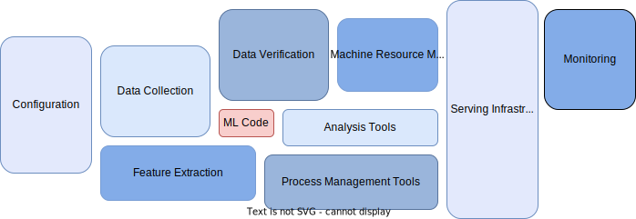

## Machine Learning Workflow

A machine learning workflow typically involves several stages. These stages are closely related and sometimes overlap as some stages may involve multiple iterations. In the following, the machine learning workflow is broken down to five different stages to make things easier, and give an overview.

**1. Data Preparation**
In the first stage, data used to train a machine learning model is collected, cleaned, and preprocessed. Preprocessing includes tasks to remove missing or duplicate data, normalize data, and split data into a training and testing set.
    
**2. Model Building** 
In the second stage, a machine learning model is selected and trained using the prepared data. This includes tasks such as selecting an appropriate algorithm as a machine learning model, training the model, and tuning the model's parameters to improve its performance.
    
**3. Model Evaluation**
Afterward, the performance of the trained model is evaluated using the test data set. This includes tasks such as measuring the accuracy and other performance metrics, comparing the performance of different models, and identifying potential issues with the model.
    
**4. Model Deployment** 
Finally, the selected and optimized model is deployed to a production environment where it can be used to make predictions on new data. This stage includes tasks like scaling the model to handle large amounts of data, and deploying the model to different environments to be used in different contexts
    
**5. Model Monitoring and Maintenance**
It is important to monitor the model performance and update the model as needed, once the model is deployed. This includes tasks such as collecting feedback from the model, monitoring the model's performance metrics, and updating the model as necessary.

Each stage is often handled by the same tool or platform which makes a clear differentiation across stages and tools fairly difficult. Further, some machine learning workflows will not have all the steps, or they might have some variations. A machine learning workflow is thereby not a walk in the park and the actual model code is just a small piece of the work. 

Working with and developing machine learning models, monitoring their performance, and continuously retraining it on new data with possible alternative models can be challenging and involves the right tools.

### ML Worflow Tools

There are several machine learning workflow tools that can help streamline the process of building and deploying machine learning models. By Integrating them into the machine learning workflow there can be three main processes and functionalities of tools derived: (1) *Workflow Management*, (2) *Model Tracking*, and (3) *Model Serving*. All three of these processes are closely related to each other and are often handled by the same tool or platform.

#### Workflow Management

Workflow Management is the process of automating and streamlining the stages involved in building, training, and deploying machine learning models. This includes tasks such as data preprocessing, model training, and model deployment. Workflow management tools allow for the coordination of all the necessary stages in the machine learning pipeline, and the tracking of the pipeline’s progress. 

*Apache Airflow* is an open-source platform for workflow management and is widely used to handle ETL-processes of data, or automate the training and deployment of machine learning models.

#### Model Tracking

Model Tracking is the process of keeping track of different versions of a machine learning model, including their performance, and the parameters and data used to train it.
Model Tracking tools are often used at the development and testing stages of the machine learning workflow. During development, tracking allows to keep track of the different versions of a model, compare their performance and learning parameters, and finally help to select the best version of the model to deploy. Model tracking also allows to check the performance of a machine learning model during testing, and to assure it meets industry requirements.

*MLflow* is an open-source platform to manage the machine learning lifecycle, including experiment tracking, reproducibility, and deployment. Similarly, *DVC* (Data Version Control) is a tool that allows to version control, manage, and track not only models but also data.

#### Model Serving

Model Serving refers to the process of deploying a machine learning model in a production environment, so it can be used to make predictions on new data. This includes tasks such as scaling the model to handle large amounts of data, deploying the model to different environments, and monitoring the performance of the deployed model. Model serving tools are specifically used at the deployment stage of the machine learning workflow and can handle the necessary tasks mentioned beforehand.

There are multiple tools that integrate the funtionality of serving models, each different in its specific use cases, for example *TensorFlow*, *Kubernetes*, *DataRobot*, or also the already mentioned tools *MLflow* and *Airflow*.

### Developing Machine Learning Models

In the development phase of a machine learning model, many stages of the machine learning workflow are carried out manually. For instance, testing machine learning code is often done in a notebook or script, rather than through an automated pipeline. Similarly, deploying the model is typically a manual process, and only involves serving the model for inference, rather than deploying an entire machine learning system.

This manual deployment process can result in infrequent deployments and the management of only a few models that do not change frequently. Additionally, the deployment process is usually not handled by Data Scientists but is instead managed by an operations team. This can create a disconnection between the development and production stages, and once deployed, there is typically no monitoring of the model's performance, meaning no feedback loop is established for retraining.

Performing stages manually and managing models in production at scale can become exponentially more challenging. To overcome these issues, it is recommended to adopt a unifying framework for production, known as MLOps. This framework will shift the focus from managing existing models to developing new ones, making the process more efficient and effective.

<!---
Relate to tools
Jupyterhub for experimentation
-->