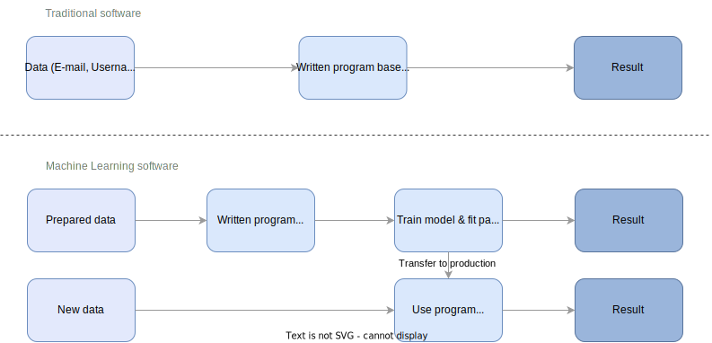
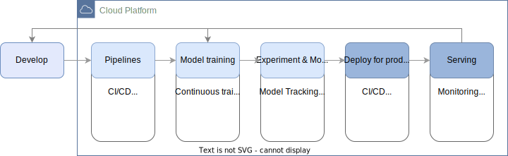

## Machine Learning Operations (MLOps)

Machine Learning Operations (MLOps) combines principles from developing and deploying machine learning models to enable an efficient operation and management of machine learning models in a production environment. The goal of MLOps is to automate and streamline the machine learning workflow as much as possible, while also ensuring that each machine learning model is performing as expected. This allows organizations to move quickly and efficiently from prototyping to production.

The infrastructure involved in MLOps includes both, hardware and software components. Hardware components aim to make the deployment of machine learning models scalable. This includes servers and storage devices for data storage and model deployment, as well as specialized hardware such as GPUs for training and inferencing. Software components include version control systems, continuous integration and continuous deployment (CI/CD) tools, containerization and orchestration tools, and monitoring and logging tools. 
There are several cloud-based platforms that provide pre-built infrastructure to manage and deploy models, automate machine learning workflows, and monitor and optimize the performance of models in production. For example AWS SageMaker, Azure Machine Learning, and Google Cloud AI Platform.

Overall, the key concepts and best practices of MLOps, and the use of tools and technologies to support the MLOps process are closely related to *regular* DevOps principles which are a standard for the operation of software in the industry.

<!---
The models built as a result of these initiatives performed impeccably in a test environment, but failed when rendered to an end-user. This was an outcome that nobody could have predicted, and ended up costing organizations millions of dollars.
-->

### ML + (Dev)-Ops

Machine Learning Operations (MLOps) and Development Operations (DevOps) both aim to improve the efficiency and effectiveness of software development and deployment. Both practices share major similarities, but there are some key differences that set them apart.

The goal of DevOps is to automate and streamline the process of building, testing, and deploying software, to make the management of the software lifecycle as quick and efficient as possible. This can be achieved by using tools, such as:

1.  *Containerization*: Tools such as Docker and Kubernetes are used to package and deploy applications and services in a consistent and reproducible manner.
2.  *Version Control*: Tools such as Git, SVN, and Mercurial are used to track and manage changes to code and configuration files, allowing teams to collaborate and roll back to previous versions if necessary.
3.  *Continuous Integration and Continuous Deployment (CI/CD)*: Tools such as Jenkins, Travis CI, and Github Actions are used to automate the building, testing, and deployment of code changes.
4.  *Monitoring and Logging*: Tools such as Prometheus, Grafana, and ELK are used to monitor the health and performance of applications and services, as well as to collect and analyze log data.
5.  *Cloud Management Platforms*: AWS, Azure, and GCP are used to provision, manage, and scale infrastructure and services in the cloud. Scaling and provisioning infrastructure can be automated by using Infrastructure as Code (IaC) Tools like Terraform.

DevOps focuses on the deployment and management of software in general (or *traditional* sofware), while MLOps focuses specifically on the deployment and management of machine learning models in a production environment. The goal is basically the same as in DevOps, yet deploying a machine learning model. While this is achieved by the same tools and best practices used in DevOps, deploying machine learning models (compared to software) adds a lot of complexity to the process.

{ width=100% }

Machine learning models are not just lines of code, but also require large amounts of data, and specialized hardware, to function properly. Further, machine learning models and their complex algorithms might need to change when there is a shift in new data. This process of ensuring that machine learning models are accurate and reliable with new data leads to additional challenges. 
Another key difference is that MLOps places a great emphasis on model governance, which ensures that machine learning models are compliant with relevant regulations and standards. The above list of tools within DevOps can be extended to the following for MLOps.

1.  *Machine Learning Platforms*: Platforms such as TensorFlow, PyTorch, and scikit-learn are used to develop and train machine learning models.
2.  *Experiment Management Tools*: Tools such as MLflow, Weights & Biases, and Airflow are used to track, version, and reproduce experiments, as well as to manage the model lifecycle.
3.  *Model Deployment and Management Tools*: Tools such as TensorFlow Serving, AWS Sagemaker, and Seldon Core are used to deploy and manage machine learning models in production.
4.  *Data Versioning and Management Tools*: Tools such as DVC (Data Version Control) and Pachyderm are used to version and manage the data used for training and evaluating models.    
5.  *Automated Model Evaluation and Deployment Tools*: Tools such as AlgoTrader and AlgoHub are used to automate the evaluation of machine learning models and deploy the best-performing models to production.

It's important to note that the specific tools used in MLOps and DevOps may vary depending on the organization's needs. Some of the tools are used in both but applied differently in each, e.g. container orchestration tools like Kubernetes. The above lists do also not claim to be complete and there are of course multiple more tools.

### MLOps Lifecycle

Incorporating the tools introduced by DevOps and MLOps can extend the machine learning workflow outlined in the [previous section](#machine-learning-workflow), resulting in a complete MLOps lifecycle that covers each stage of the machine learning process while integrating automation practices.

{ width=100% }

Integrating MLOps into machine learning projects introduces additional complexity into the workflow. Although the development stage can be carried out on a local machine, subsequent stages are typically executed within a cloud platform. Additionally, the transition from one stage to another is automated using tools like CI/CD, which automate testing and deployment.

MLOps also involves integrating workflow management tools and model tracking to enable monitoring and ensure reproducible model training. This enables proper versioning of code, data, and models, providing a comprehensive overview of the project.

### MLOps Engineering

MLOps Engineering is the discipline that applies the previously mentioned software engineering principles to create the necessary development and production environment for machine learning models. It usually comines the skills and expertise of Data Scientists and -Engineers, Machine Learning Engineers, and DevOps engineers to ensure that machine learning models are deployed and managed efficiently and effectively.

One of the key aspects of MLOps Engineering is infrastructure management. The infrastructure refers to the hardware, software and networking resources that are needed to support the machine learning models in production. The underlying infrastructure is crucial for the success of MLOps as it ensures that the models are running smoothly, are highly available and are able to handle the load of the incoming requests. It also helps to prevent downtime, ensure data security and guarantee the scalability of the models.

MLOps Engineering is responsible for designing, building, maintaining and troubleshooting the infrastructure that supports machine learning models in production. This includes provisioning, configuring, and scaling the necessary resources like cloud infrastructure, Kubernetes clusters, machine learning platforms, and model serving infrastructure. It is useful to use configuration management and automation tools like Infrastructure as Code (e.g. Terraform) to manage the infrastructure in a consistent, repeatable and version controlled way. This allows to easily manage and scale the infrastructure as needed, and roll back to previous versions if necessary.

It is important to note that one person can not exceed on all of the above mentioned tasks of designing, building, maintaining, and troubleshooting. Developing the infrastructure for machine learning models in production usually requires multiple people working with different and specialized skillsets and roles.

