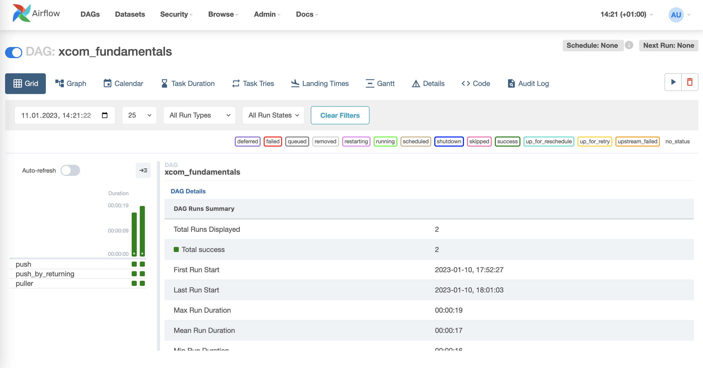

## Core Components

Airflow serves as a batch-oriented workflow orchestration plattform. Workflows vary in their levels of complexity and in general it is a term with various meaning depending on context. When working with Airflow, a workflow usually describes a set of steps to accomplish a given data engineering tasks, e.g. downloading files, copying data, filtering information, or writing to a database, etc.

An exemplary use case might be to set up an ETL pipeline that extracts data from multiple sources, the transformation of the data, as well as loading them into a machine learning model. Even the training itself of a ML model can triggered via Airflow. Another workflow step might involve the generation of a report or backups. 

Even though Airflow can implement programs from any language, the workflows are written and defined as Python code. Airflow allows to access each workflow via the previously mentioned web user interface, or via a command-line interface. 
Writing workflows in code has the benefit to use version control systems like *Git* to ensure roll backs to previous versions as well as to develop a workflow with a team of developers simultaneously. Using *Git* also allows to include further DevOps principles such as pipelines, and testing and validating the codes functionality.


### DAGs

A workflows in Airflow is implemented as a DAG, a *Directed Acyclic Graph*. A *graph* describes the actual set of components of a workflow. It is *directed* because it has an inherent flow representing dependencies between its components. It is *acyclic* as it does not loop or repeat.

The DAG object is needed to nest the separate tasks intp a workflow. A workflow specified in code, e.g. Python, is often also referred to as a *pipeline*. This terminology can be used synonymosly when working with Airflow. The following code snippet depicts how to define a DAG object in Python code. The `dag_id` string is a unique identifier to the DAG object. The `default_args` dictionary consists of additional parameters that can be specified. There are only shown two additional parameters. There are a lot more though which can be seen in the [official documentation](https://airflow.apache.org/docs/apache-airflow/stable/_api/airflow/models/dag/index.html#airflow.models.dag.DAG).

\footnotesize
```python
from airflow.models import DAG
from pendulum import datetime

# Using extra arguments allows to customize in a clear structure
# e.g. when setting the time zone in a DAG.
default_args = {
    'start_date': datetime(2023, 1, 1, tz="Europe/Amsterdam"),
    'schedule_interval': 'None'
}

example_dag = DAG(
    dag_id='DAG_fundamentals',
    default_args=default_args
)
```
\normalsize

The state of a workflow can accessed via the web user inteface, such as shown in below images. The first image shows Airflows overview of all DAGs currently "Active" and further information about them such as their "Owner", how many "Runs" have been performaned and whether they were successful, and much more. 
The second image depicts a detailed overview of the DAG "xcom_fundamentals". Besudes looking into the *Audit Logs* of the DAG and the *Task Duration*, it is also possible to check the *Code* of the DAG.

{ width=100% }

{ width=100% }

The Airflow command line interface also allows to interact with the DAGs. Below command shows its exemplary usage and how to list all active DAGs. Further examples of using the CLI in a specific context are show in the subsection about Tasks.

\footnotesize
```bash
# Create the database schema
airflow db init

# Print the list of active DAGs
airflow dags list
```
\normalsize

People sometimes think of a DAG definition file as a place where the actual data processing is done. That is not the case at all! The scripts purpose is to only define a DAG object. It needs to evaluate quickly (in seconds, not minutes) since the scheduler of Airflow will load and execute it periodically to account for changes in the DAG definition.
A DAG usually consists of multiple steps it runs through, also names as *tasks*. Tasks themselves consist of *operators*. This will be outlined in the following subsections.

### Operators

An Operator represents a single predefined task in a workflow. It is basically a unit of work that Airflow has to complete. Operators usually run independently and generally do not share any information by themselves. There are different categories of operators to perform different tasks with, for example *Action operators*, *Transfer operators*, or *Sensors*.
*Action Operators* execute a basic task based on the operators specifications. Examples are the `BashOperator`, the `PythonOperator`, or the `EmailOperator`. The operator names already suggest what kind of executions they provide; the PythonOperator runs Python tasks.
*Transfer Operators* are designed to transfer data from one place to another, for example to copy data from one cloud bucket to another. Those operators are often stateful, which means the downloaded data are first stored locally and then uploaded to a destination storage. The principle of a stateful execution defines them as an own category of operator. 
Finally, *Sensors* are a special subclass of operators that are triggered when an external event is happening, for example the creation of a file.

> **_NOTE:_** The `PythonOperator` is actually declared a deprecated function. Airflow 2.0 promotes to use the `@task`-decorator of *Taskflow* to define tasks in a more pythonic context. Yet, it still works in Airflow 2.0 and is still a very good example on how operators work.

#### Action Operators

**BashOperator**

As its name suggests, the `BashOperator` executes commands in the bash shell. 

\footnotesize
```python
from airflow.operators.bash_operator import BashOperator

bash_task = BashOperator(
    task_id='bash_example',
    bash_command='echo "Example Bash!"',
    dag=action_operator_fundamentals
)
```
\normalsize

**PythonOperator**

The `PythonOperator` expects a Python callable. Airflow passes a set of keyword arguments from the `op_kwargs` dictionary to the callable as input.

\footnotesize
```python
from airflow.operators.python_operator import PythonOperator

def sleep(length_of_time):
    time.sleep(length_of_time)

sleep_task = PythonOperator(
    task_id='sleep',
    python_callable=sleep,
    op_kwargs={'length_of_time': 5},
    dag=action_operator_fundamentals
)
```
\normalsize

**EmailOperator**

The `EmailOperator` allows to send predefined emails from an Airflow DAG run. For example, this could be used to notify if a workflow was successfull or not. The `EmailOperator` does require the Airflow system to be configured with email server details as a prerequisite. Please refer to the official docs on how to do this.

\footnotesize
```python
from airflow.operators.email_operator import EmailOperator

email_task = EmailOperator(
    task_id='email_sales_report',
    to='sales_manager@example.com',
    subject='automated Sales Report',
    html_content='Attached is the latest sales report',
    files='latest_sales.xlsx',
    dag=action_operator_fundamentals
)
```
\normalsize

#### Transfer Operators

**GoogleApiToS3Operator**

The `GoogleApiToS3Operator` makes requests to any Google API that supports discovery and uploads its response to AWS S3. The example below loads data from Google Sheets and saves it to an AWS S3 file.

\footnotesize
```python
from airflow.providers.amazon.aws.transfers.google_api_to_s3 import GoogleApiToS3Operator

google_sheet_id = <GOOGLE-SHEET-ID >
google_sheet_range = <GOOGLE-SHEET-RANGE >
s3_destination_key = <S3-DESTINATION-KEY >

task_google_sheets_values_to_s3 = GoogleApiToS3Operator(
    task_id="google_sheet_data_to_s3",
    google_api_service_name="sheets",
    google_api_service_version="v4",
    google_api_endpoint_path="sheets.spreadsheets.values.get",
    google_api_endpoint_params={
        "spreadsheetId": google_sheet_id, "range": google_sheet_range},
    s3_destination_key=s3_destination_key,
)
```
\normalsize

**DynamoDBToS3Operator**

The `DynamoDBToS3Operator` copies the content of an AWS DynamoDB table to an AWS S3 bucket. It is also possible to specifiy criteria such as `dynamodb_scan_kwargs` to filter the transfered data and only replicate records according to criteria.

\footnotesize
```python
from airflow.providers.amazon.aws.transfers.dynamodb_to_s3 import DynamoDBToS3Operator

table_name = <TABLE-NAME >
bucket_name = <BUCKET-NAME >

backup_db = DynamoDBToS3Operator(
    task_id="backup_db",
    dynamodb_table_name=table_name,
    s3_bucket_name=bucket_name,
    # Max output file size in bytes.  If the Table is too large, multiple files will be created.
    file_size=20,
)
```
\normalsize

**AzureFileShareToGCSOperator**

The `AzureFileShareToGCSOperator` transfers files from the Azure FileShare to the Google Storage. Even though the storage systems are quite similar, this operator is beneficial when the cloud provider needs to be changed. The `share_name`-parameter denotes the Azure FileShare share name to transfer files from. Similarly, the `dest_gcs`specifies the destination bucket on the Google Cloud.

\footnotesize
```python
from airflow.providers.google.cloud.transfers.azure_fileshare_to_gcs import AzureFileShareToGCSOperator

azure_share_name = <AZURE-SHARE-NAME >
bucket_name = <BUCKET-NAME >
azure_directory_name = <AZURE-DIRECTORY-NAME >

sync_azure_files_with_gcs = AzureFileShareToGCSOperator(
    task_id="sync_azure_files_with_gcs",
    share_name=azure_share_name,
    dest_gcs=bucket_name,
    directory_name=azure_directory_name,
    replace=False,
    gzip=True,
    google_impersonation_chain=None,
)
```
\normalsize

#### Sensors

A *sensor* is a special subclass of an operator that is triggered when an external event is happening or a certain condition is be true. Such conditions are for example the creation of a file, an upload of a database record, or a certain response from a web request.

It is also possible to specify further requirements to check the condition. The `mode` argument sets how to check for a condition. `mode='poke'` denotes to run a task repeatedly until it is successful (this is the default), whereas `mode='reschedule'` gives up a task slot and tries again later.
Simultaneously, the `poke_interval` defines how long a sensor should wait between checks, and the `timeout` parameter defines how long to wait before letting a task fail. Below example shows a `FileSensor` that checks the creation of a file with a `poke_interval` defined.

\footnotesize
```python
from airflow.contrib.sensors.file_sensor import FileSensor

file_sensor_task = FileSensor(task_id='file_sense',
                              filepath='salesdata.csv',
                              poke_interval=30,
                              dag=sensor_operator_fundamentals
                              )
```
\normalsize

Other sensors are for example:
* `ExternalTaskSensor` - waits for a task in another DAG to complete
* `HttpSensor` - Requests a web URL and checks for content
* `SqlSensor` - Runs a SQL query to check for content

###  Tasks

To use an operator in a DAG it needs to be instantiated as a task. Tasks determine how to execute an operator’s work within the context of a DAG. The concepts of a *Task* and *Operator* are actually somewhat interchangeable as each task is actually a subclass of Airflow’s `BaseOperator`. However, it is useful to think of them as separate concepts. Tasks are Instances of operators and are usually assigned to a Python variable.
The following code instantiates the `BashOperator` to two different variables `task_1` and `task_2`. The `depends_on_past` argument ensures that the previously scheduled task has succeeded before the current task is triggered.

\footnotesize
```python
task_1 = BashOperator(
    task_id="print_date",
    bash_command="date",
    dag=task_fundamentals
)

task_2 = BashOperator(
    task_id="set_sleep",
    depends_on_past=False,
    bash_command="sleep 5",
    retries=3,
    dag=task_fundamentals
)

task_3 = BashOperator(
    task_id="print_success",
    depends_on_past=True,
    bash_command='echo "Success!"',
    dag=task_fundamentals
)
```
\normalsize

Tasks can be referred to by their `task_id` either using the web interface or using the CLI within the airflow tools. `airflow tasks test` runs task instances locally, outputs their log to stdout (on screen), does not bother with dependencies, and does not communicate the state (running, success, failed, …) to the database. It simply allows testing a single task instance. The same accounts for `airflow dags test`

\footnotesize
```bash
# Run a single task with the following command
airflow run <dag_id> <task_id> <start_date>

# Run tasks locally for testing
airflow tasks test <dag_id> <task_id> <input-parameter>

# Testing the task print_date
airflow tasks test task_fundamentals print_date 2015-06-01

# Testing the task sleep
airflow tasks test task_fundamentals sleep 2015-06-01
```
\normalsize

#### Task dependencies

A machine learning or data workflow usually has a specific order in which its tasks should run. Airflow alloes to define a specific order of task completion using task dependencies that are either referred to as upstream or downstream tasks. In Airflow 1.8 and later, this can be defined using the *bitshift operators* in Python.

* **>>** - or the upstream operator (before)
* **<<** - or the downstream operator (after)

An exemplary code and chaining examples of tasks would look like this:

\footnotesize
```python
# Simply chained dependencies
task_1 >> task_2 >> task_3
```
\normalsize

{ width=100% }

\footnotesize
```python
# Mixed dependencies
task_1 >> task_3 << task_2

# which is similar to
task_1 >> task_3
task_2 >> task_3

# or
[task_1, task_2] >> task_3
```
\normalsize

{ width=100% }

\footnotesize
```python
# It is also possible to define dependencies with
task_1.set_downstream(task_2)
task_3.set_upstream(task_1)
```
\normalsize

{ width=100% }

\footnotesize
```python
# It is also possible to mix it completely wild
task_1 >> task_3 << task_2
task_1.set_downstream(task_2)
```
\normalsize

{ width=100% }

It is possible to list all tasks within a DAG using the CLI. Below commands show two approaches.

\footnotesize
```bash
# Prints the list of tasks in the "task_fundamentals" DAG
airflow tasks list task_fundamentals

# Prints the hierarchy of tasks in the "task_fundamentals" DAG
airflow tasks list task_fundamentals --tree
```
\normalsize

In general, each task of a DAG runs on a different compute resource (also called worker). It may require an extensive use of environment variables to achieve running on the same environment or with elevated privileges. This means that tasks naturally cannot cross communicate which impedes the exchange of information and data. To achieve cross communication an additional feature of Airflow needs to be used, called *XCom*. 

### XCom

*XCom* (short for “cross-communication”) is a mechanism that allows information passing between tasks in a DAG. This is beneficial as by default tasks are isolated within Airflow and may run on entirely different machines. 
The goal of using XComs is not to pass large values like dataframes themselves. XComs are used to store all relevant metadata that are needed to pass data from one task to another, including infomration about the sender, the recipient, and the data itself.

If there is the need to pass a big data frame from *task_a* to *task_b*, the data is stored in a persistent storage solution (a bucket, or database) and the information about the storage location is stored in the XCom. This means that *task_a* pushes the data to a storage solution and writes the information where the data is stored (e.g. a AWS S3 URI) within an XCom to the Airflow database. Afterward, *task_b* can access this information and retrieve the data from the external storage using the AWS .

The XCom is identified by a *key*-*value* pair stored in the Airflow Metadata Database. The `key` of an XCom is basically its name and consists of a tuple (`dag_id`, `task_id`, `execution_date`,`key`). *key* within the XComs name denotes the name of the stored data and is a configurable string (by default it’s `return_value`). The XComs `value` is a json serializable. It is important to note that it is only designed for small amounts of data, depending on the attached metadata database (e.g. 2GB for SQLite, or 1GB Postgres database). XComs are explicitly pushed and pulled to/from the metadata database using the `xcom_push` and `xcom_pull` methods. While the `push_*`-methods upload the XCom, the `pull`-method downloads information from XCom. The XCom element can be viewed within Airflows web interface which is quite helpful to debug or monitor a DAG.

Below example shows this mechanics. However, when looking at the `push` one can see a difference in their functionality. The method `push_by_returning` uses the operators' auto-push functionality that pushes their results into an default XCom key (the default is `return_value`). Using the auto-push functionality allows to only use Python `return` statements and is enabled by setting the `do_xcom_push` argument to `True`, which it also is by default ( `@task` functions do this as well). To push an XCom with a specific key, the `xcom_push`-method needs to be called explicitly. In order to access the `xcom_push` one needs to access the task instance (ti) object. It can be accessed by passing the `"ti"` parameter to the Python callable of the PythonOperator. Its usage can be seen in the `push` method, where also a custom key is given to the XCom.
Similarly, the `puller` function uses the `xcom_pull` method to pull the previously pushed values from the metadata databes.

\footnotesize
```python
from airflow.models import DAG
from pendulum import datetime
from airflow.operators.python_operator import PythonOperator

xcom_fundamentals = DAG(
    dag_id='xcom_fundamentals',
    start_date=datetime(2023, 1, 1, tz="Europe/Amsterdam"),
    schedule_interval=None
)

# DAG definition etc.
value_1 = [1, 2, 3]
value_2 = {'a': 'b'}

def push(**kwargs):
    """Pushes an XCom without a specific target"""
    kwargs['ti'].xcom_push(key='value from pusher 1', value=value_1)

def push_by_returning(**kwargs):
    """Pushes an XCom without a specific target, just by returning it"""
    # Airflow does this automatically as auto-push is turned on.
    return value_2

def puller(**kwargs):
    """Pull all previously pushed XComs and check if the pushed values match the pulled values."""
    ti = kwargs['ti']

    # get value_1
    pulled_value_1 = ti.xcom_pull(key=None, task_ids='push')

    # get value_2
    pulled_value_2 = ti.xcom_pull(task_ids='push_by_returning')

    # get both value_1 and value_2 the same time
    pulled_value_1, pulled_value_2 = ti.xcom_pull(
        key=None, task_ids=['push', 'push_by_returning'])

    print(f"pulled_value_1: {pulled_value_1}")
    print(f"pulled_value_2: {pulled_value_2}")

push1 = PythonOperator(
    task_id='push',
    # provide context is for getting the TI (task instance ) parameters
    provide_context=True,
    dag=xcom_fundamentals,
    python_callable=push,
)

push2 = PythonOperator(
    task_id='push_by_returning',
    dag=xcom_fundamentals,
    python_callable=push_by_returning,
    # do_xcom_push=False
)

pull = PythonOperator(
    task_id='puller',
    # provide context is for getting the TI (task instance ) parameters
    provide_context=True,
    dag=xcom_fundamentals,
    python_callable=puller,
)

# push1, push2 are upstream to pull
[push1, push2] >> pull
```
\normalsize

### Scheduling

A workflow can be run either triggered manually or on a scheduled basis. Each DAG maintains a state for each workflow and the tasks within the workflow, and specifies whether it is *running*, *failed*, or a *success*. Airflow scheduling is designed to run as a persistent service in an production environment and can be customized. When running Airflow locally, executing the `airflow scheduler` via the CLI will use the configuration specified in `airflow.cfg` and start the service.

The Airflow scheduler monitors all DAGs and tasks, and triggers those task instances whose dependencies have been met. A scheduled tasks needs several attributes specified. When looking at the first example of how to define a DAG we can see that we already defined the attributes `start_date`, and `schedule_interval`. We can also add optional attributes such as `end_date`, and `max_tries`.

\footnotesize
```python
from airflow.models import DAG

default_args = {
    'start_date': '2023-01-01',
    # (optional) when to stop running new DAG instances
    'end_date': '2023-01-01',
    # (optional) how many attempts to make
    'max_tries': 3,
    'schedule_interval': '@daily'
}

example_dag = DAG(
    dag_id='scheduling_fundamentals',
    default_args=default_args
)
```
\normalsize

### Taskflow

Defining a DAG and using operators as shown in the previous sections is the classic approach to define a workflow in Airflow. However, *Airflow 2.0* introduced the TaskFlow API which allows to work in a more pythonic way using decorators. DAGs and tasks can be created using the `@dag`or `@task` decorators. The function name itself acts as the unique identifier for the DAG or task respectively.

All of the processing in a TaskFlow DAG is similar to the traditional paradigm of Airflow, but it is all abstracted from the developers. This allows developers to focus on the code. There is also no need to specify task dependencies as they are automatically generated within TaskFlow based on the functional invocation of tasks.

Defining a workflow of an ETL-pipeline using the TaskFlow paradigm is shown in belows example. The pipeline invokes an *extract* task, sends the ordered data to a *transform* task for summarization, and finally invokes a *load* task with the previously summarized data. Its quite easy to catch that the Taskflow workflow contrasts with Airflow's traditional paradigm in several ways.

\footnotesize
```python
import json
import pendulum
from airflow.decorators import dag, task

# Specify the dag using @dag
# The Python function name acts as the DAG identifier
# (see also https://airflow.apache.org/docs/apache-airflow/stable/tutorial_taskflow_api.html)

@dag(
    schedule=None,
    start_date=pendulum.datetime(2021, 1, 1, tz="UTC"),
    catchup=False,
    tags=["example"],
)
def taskflow_api_fundamentals():
    # set a task using @task
    @task()
    def extract():
        data_string = '{"1001": 301.27, "1002": 433.21, "1003": 502.22}'
        order_data_dict = json.loads(data_string)
        return order_data_dict

    @task(multiple_outputs=True)
    def transform(order_data_dict: dict):
        total_order_value = 0
        for value in order_data_dict.values():
            total_order_value += value
        return {"total_order_value": total_order_value}

    @task()
    def load(total_order_value: float):
        print(f"Total order value is: {total_order_value:.2f}")

    # task dependencies are automatically generated
    order_data = extract()
    order_summary = transform(order_data)
    load(order_summary["total_order_value"])

# Finally execute the DAG
taskflow_api_fundamentals()
```
\normalsize

Even the passing of data between tasks which might run on different workers is all handled by TaskFlow so there is no need to use XCom. However, XCom is still used behind the scenes, but all of the XCom usage passing data between tasks is abstracted away. This allows to view the XCom in the Airflow user interface as before. 
Belows example shows the `transform` function written in the traditional Airflow using XCom and highlights the simplicity of using TaskFlow.

\footnotesize
```python
def transform(**kwargs):
    ti = kwargs["ti"]
    extract_data_string = ti.xcom_pull(task_ids="extract", key="order_data")
    order_data = json.loads(extract_data_string)

    total_order_value = 0
    for value in order_data.values():
        total_order_value += value

    total_value = {"total_order_value": total_order_value}
    total_value_json_string = json.dumps(total_value)
    ti.xcom_push("total_order_value", total_value_json_string)
```
\normalsize

As it is clearly visible, using TaskFlow is an easy approach to workflowing in Airflow. It takes away a lot of worries when it comes to building pipelines and allows for a flexible programing experience using decorators. It allows for several more functionalities, such as reusing decorated tasks in multiple DAGs, overriding task parameters like the `task_id`, custom XCom backends to automatically store data in e.g. AWS S3, and using TaskGroups to group multiple tasks for a better overview in the Airflow Interface.

However, even though Taskflow allows for a smooth way of developing workflows, it is beneficial to learn the traditional Airflow API to understand the fundamental concepts of how to create a workflow. The following section will build up on that knowledge and depict a full machine learning workflow as an example.
