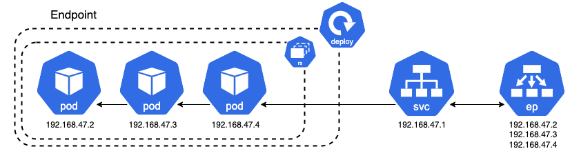

## Services & Networking


### Services

To overall question when deploying an application is how we can access it. Each individual Pod has its own IP address. Thereby, the client can access this Pod via its IP address. Previously, we have made the app available via `kubectl port-forward` by forwarding the Pods' IP to localhost. However, should only be done for testing purposes and is not a reliable and stable way to enable access. Since Pods are ephemeral, the client cannot rely on the ip address alone. For example, if an application is scaled up or down, there will be new IPs associated with each new Pod.

 

Instead, *Services* should be used. A service is an abstract way to expose an application as a network service. The service can connect access to a pod via an interal reference, so a change of the Pods IP will not interfere with its accessibility. The service itself has a stable IP adress, a stable DNS name, and a stable port. This allows for a reliable and stable connection from the client to the service, which can then direct the traffic to the pod. There are different types of Services.

+ ClusterIP (Default)
+ NodePort
+ ExternalName
+ LoadBalancer

#### ClusterIP 
The ClusterIP is the default K8s service. This service type will be chosen if no specific type is selected. The ClusterIP is used for cluster internal access and does not allow for external communication. If one Pod wants to talk to another Pod inside the cluster, it will use ClusterIP to do so. The service will allow and send traffic to any pod that is healthy.

#### NodePort
The NodePort service allows to open a static port simultaneously on all nodes. Its range lies between between 30.000/32.767. If a client wants to communicate with a node of the cluster, the client directly communicates with the node via its IP address. When the request reaches the port of the node, the NodePort service handles the request and forwards it to the specifically marked pod. This way, an application running on a pod can be exposed directly on a nodes' IP under a specific port. You'll be able to contact the NodePort Service from outside the cluster by requesting `<NodeIP>:<NodePort>`.

Using a NodePort is beneficial for example when a request is sent to a node without a pod. The NodePort service will forward the request to a node which has a healthy associated pod running. However, only having one service specified per port is also a disadvantage. Having one ingress and multiple services is more desireable. The point of running K8s in the cloud is to scale up and down and if the NodeIP address changes, then we have a problem. So we should not aim to access a Node IP directly in the first place

If applying below example using the frontend-deployment and the backend-deployment, we can access the frontend using the nodeport. Since using minikube, we can access the service by using `minikube service frontend-node --url`. Using the given IP adress it is possible to access the frontend using the NodePort service. We can also test the NodePort service when inside of a node. When accessing a node e.g. via `minikube ssh`, we can run `curl localhost:PORT/` inside the node to derive the to derive the website data from the frontend.

#### LoadBalancer
Loadbalancers are a standard way of exposing applications to the extern, for example the internet. Loadbalancers automatically distribute incoming traffic across multiple targets to balance the load in an equal level. If K8s is running on the cloud, e.g. AWS or GCP, a Network Load Balancer (NLB) is created. The Cloud Controller Manager (remember the Controller Manager of a Node) is resposible to talk to the underlying cloud provier. In Minikube, the external IP to access the application via the LoadBalancer can be exposed using the command `minikube tunnel`. 

#### default kubernetes services
There are also default K8s services created automatically to access K8s with the K8s API. Check the endpoints of the *kubernetes* service and the endpoints of the *api-service* pod within kube-system namespace. They should be the same.

It is also possible to show all endpoints of the cluster using
```bash
kubectl get endpoints
```

#### Exemplary setup of database and frontend microservices

The following example show the deployment and linking of two different deployments. A *frontend-deployment.yaml* that pulls a container running a [Streamlit App](https://streamlit.io/), and a *database-deployment.yaml* that runs a flask application exposing a dictionary as an exemplary and very basic database. The frontend accesses the flask database using a ClusterIP Service linked to the database-deployment. It also exposes an external IP via a Loadbalancer Service, so the streamlit app can be accesses via the browser and without the use of `kubectl port-forward`. Since minikube is a closed network, use `minikube tunnel` to allow access to it using the LoadBalancer.

When looking at the ClusterIP service with `kubectl describe service backendflask` the IP address of the service to exposes, as well as the listed endpoints that connect to the database-deployments are shown. One can compare them to the IPs of the actual deployments - they are the same.

```yaml
# services_frontend-deployment.yaml
apiVersion: apps/v1
kind: Deployment
metadata:
  name: frontend
spec:
  replicas: 2
  selector:
    matchLabels:
      app: frontend
  template:
    metadata:
      labels:
        app: frontend
    spec:
      containers:
      - name: frontend
        image: seblum/mlops-public:frontend-streamlit
        imagePullPolicy: "Always"
        resources:
          limits:
            memory: "128Mi"
            cpu: "500m"
        # enviroment variable defined in the application and dockerfile
        # value is ip adress of the order
        env:
            # using the ip adress would be a bad idea.
            # use the service ip adress.
            # value: "<order-service-ip-adress>:8081"
            # how to do it should be this.
            # we reference to the order service
          - name: DB_SERVICE
            value: "backendflask:5001"
        ports:
          # we can actually use the actual ip of the service or
          # use the dns, as done in the example above.
        - containerPort: 8501
---
apiVersion: v1
kind: Service
metadata:
  name: frontend-lb
spec:
  type: LoadBalancer
  selector:
    app: frontend
  ports:
  - port: 80
    targetPort: 8501
---
apiVersion: v1
kind: Service
metadata:
  name: frontend-node
spec:
  type: NodePort
  selector:
    app: frontend
  ports:
  - port: 80
    targetPort: 8501
    nodePort: 30000
```

```yaml
# services_backend-deployment.yaml
apiVersion: apps/v1
kind: Deployment
metadata:
  name: backendflask
spec:
  replicas: 2
  selector:
    matchLabels:
      app: backendflask
  template:
    metadata:
      labels:
        app: backendflask
    spec:
      containers:
      - name: backendflask
        image: seblum/mlops-public:backend-flask
        imagePullPolicy: "Always"
        resources:
          limits:
            memory: "128Mi"
            cpu: "500m"
        ports:
        - containerPort: 5000
---
apiVersion: v1
kind: Service
metadata:
  name: backendflask
spec:
  # send traffic to any pod that matches the label
  type: ClusterIP # does not need to be specified
  selector:
    app: backendflask
  ports:
    # port the service is associated with
  - port: 5001
    # port to access targeted by the access
    # in our case has to be the same as in backendflask.
    targetPort: 5000
```


### Service Discovery

Service Discovery is a mechanism that lets applications and microservices locate each other on a network. In fact, we have aready used Service Discovery in the previous sections, they just haven't been mentioned yet. If a client wants to communicate with the application, it should not use the IP of an individual Pod should not use the individual pod ip. Instead, we should rely on services as they have a stable IP address. We have already seen this in the section about Services. Yet, each pod has also an individual DNS (Domain Name System). A DNS translates a domain names to an IP address, just one lookes up a number in a telephone book, so it's much easier to reference to a resource online. This is where service Discovery enters the game.

 

Whenever a service is created, it is registered in the service registry with the service name and the service IP. Most clusters use CoreDNS as a service registry (this would be the telephone book itself). When having a look at the minikube cluster one should see are *core-dns* service running. Now you know what it is for. Having a closer look using `kubectl describe svc <name>`, the core-dns service has only one endpoint. If you want to have an even closer look, you can dive into a pod itself and check the file /etc/resolv.conf. There you find a nameserver <IP> where the IP is the one of the core-dns. 

```bash
# when querying services, it necessary 
# to specify the corresponding namespace
kubectl get service -n kube-system

# command for queriying the dns  
nslookup <podname>
```

#### kube-proxy

As mentioned earlier, each node has three main components: Kubelet, Container Runtime, and the Kube-Proxy. *Kube-Proxy* is a network proxy running on each node and is responsible for internal network communications as well as external.

It also implements a controller that watches the API server for new services and endpoints. Whenever there is a new service or endpoint, the kube-proxy creates a local IPVS rule (IP Virtual Server) that tells the node to intercept traffic destined to the ClusterIP Service. IPVS is built on top of the network filter and implements a transport-layer load balancing. This gives the ability to load balance to real service as well as redirecting traffic to pods that match service label selectors.

This means, kube-proxy is intercepting all the requests and makes sure that when a request to the ClusterIP service is sent using endpoints, the request is forwarded to the healthy pods behind the endpoint. 

