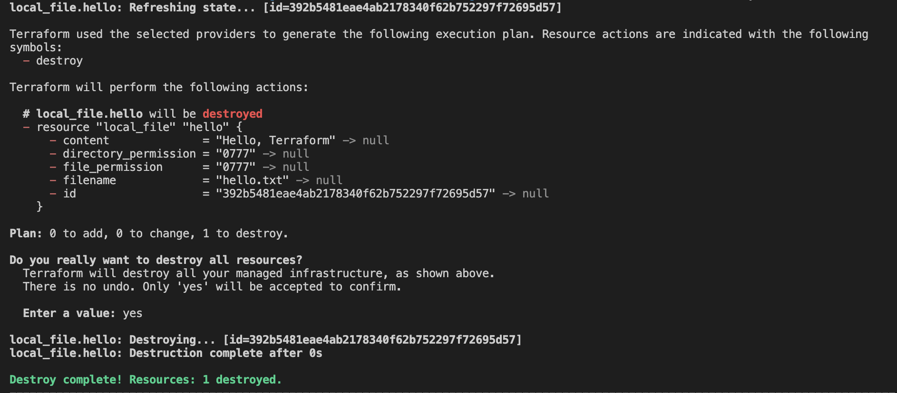

## Basic usage

A Terraform project is basically just a set of files in a directory containing resource definitions of cloud ressources to be created. Those Terraform files, denoted by the ending `.tf`, use Terraform's configuration language to define the specified resources. In the following example there are two definitions made: a `provider` and a `resource`. Later in this chapter we will dive deeper in the structure of the language. For now, we only need to know this script is creating a file called `hello.txt` that includes the text `"Hello, Terraform"`. It's our Terraform version of Hello World!

```bash
provider "local" {
  version = "~> 1.4"
}
resource "local_file" "hello" {
  content = "Hello, Terraform"
  filename = "hello.txt"
}
```

### terraform init

When a project is run for the first time the terraform project needs to be initialized. This is done via the `terraform init` command. Terraform scans the project files in this step and downloads any required providers needed (more details to providers in a following section). In the given example this is the local procider.

```bash
# Initializes the working directory which consists of all the configuration files
terraform init
```

 


### terraform validate

The `terraform validate` command checks the code for syntax errors. This is optional yet a way to handle initial errors or minor careless mistakes 

```bash
# Validates the configuration files in a directory
terraform validate
```
 

### terraform plan

The `terraform plan` command verifies what action Terraform will perform and what resources will be created. This step is basically a *dry run* of the code to be executed. It also returns the provided values and some permission attributes which have been set.

```bash
# Creates an execution plan to reach a desired state of the infrastructure
terraform plan
```

 


### terraform apply

The command `Terraform apply` creates the resource specified in the `.tf` files. Initially, the same output as in the `terraform plan` step is shown (hence its *dry run*). The output further states which resources are added, which will be changed, and which resources will be destroyed. After confirming the actions the resource creation will be executed.

Modifications to previously deployed ressources can be implemented by using `terraform apply` again. The output will denote that there are resources to change.

```bash
# Provision the changes in the infrastructure as defined in the plan
terraform apply 
```

 


### terraform destroy

To destoy all created ressouces and to delete everything we did before, there is a `terraform destroy` command.

```bash
# Deletes all the old infrastructure resources
terraform destroy
```

 

