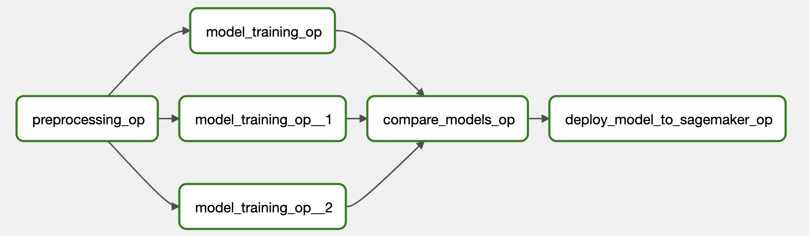

## Training & Deployment Pipeline Workflow

The code and machine learning pipeline have been modularized into distinct steps, including preprocessing, model training, model comparison, and model serving. Airflow serves as the model workflow tool, generating DAGs for managing the pipeline. MLflow is integrated to facilitate model tracking, registry, and serving functionalities. To ensure portability and scalability, the codebase has been containerized using Docker, allowing it to be executed in Docker and/or Kubernetes environments. A detailed explanation of how these components function will be provided in the following section.

The `src` code is installed as a Python package within the Docker container, enabling easy invocation within the Airflow DAG. However, it is important to note that although Model Serving is triggered within the Airflow pipeline, the serving itself is not done on the Airflow and the EKS cluster respectively, but the model is served on an AWS Sagemaker instance.


### Airflow Workflow

The configuration for the Airflow DAG, encompassing its structure, tasks, and task dependencies, can be located within the `airflow_k8s_workflow_DAG.py` file. The DAG is constructed utilizing the TaskFlow API.

In the context of this use case, the ML pipeline comprises three primary phases: preprocessing, training, and serving. The preprocessing phase encompasses data manipulation and its subsequent storage within the S3 repository. The training phase and its associated code are designed to accommodate various TensorFlow models, facilitating parallel training across multiple models, consequently reducing the deployment time. Given the existence of multiple models, it becomes imperative to serve only the model that exhibits the most favorable metrics based on the present data. As a result, an intermediary step is incorporated to compare the metrics of all the models and select the most optimal one for serving.

{ width=100% }

To execute these pipeline phases, the Airflow Kubernetes Operator is utilized. This operator guarantees that each phase operates within an independent and segregated environment using either Docker or Kubernetes jobs. To enable this process, it is necessary to containerize the code using Docker. Subsequently, the Airflow task invokes the relevant Python code methods and executes them in accordance with the specified requirements.


### MLflow integration

Mlflow is leveraged in the preprocessing and model training stages to store crucial data parameters, model training parameters, and metrics, while also enabling the saving of trained models in the model registry. In the `airflow_k8s_workflow_DAG.py` file, Mlflow is invoked to create an experiment, and the experiment ID is passed to each pipeline step to store parameters in separate runs. This ensures a clear distinction between the execution of different models.

The `train_model` pipeline steps serve as a container for the model training procedure. Within the container, the model is trained using specific code. All the relevant information about the model and the model itself are logged using mlflow as well. This workflow ensures the comprehensive tracking of model parameters and metrics, and the saved model can be accessed and compared during the subsequent model comparison step. In fact, during this stage, the best model is transferred to another model stage within the model registry.


### Pipeline Workflow 

The code below defines the `cnn_skin_cancer_workflow` function as an Airflow DAG using the `dag` decorator. Each step of the pipeline, including data preprocessing, model training, model comparison, and serving the best model, is represented as a separate task with the `@task.kubernetes` decorator. Dependencies between these tasks are established by passing the output of one task as an argument to the next task. The `cnn_skin_cancer_workflow` object serves as a representation of the entire DAG.

The code starts by importing various Python modules and libraries, defining several variables and parameters, and setting up an Enum class for distinguishing different models and model parameters.

\footnotesize
```python 
import os
from enum import Enum

import mlflow
import pendulum
from airflow.decorators import dag, task
from airflow.kubernetes.secret import Secret
from airflow.models import Variable
from airflow.operators.bash import BashOperator
from airflow.providers.docker.operators.docker import DockerOperator
from kubernetes.client import models as k8s

################################################################################
#
# SET VARIOUS PARAMETERS
#
EXPERIMENT_NAME = "cnn_skin_cancer"  # mlflow experiment name
skin_cancer_container_image = "seblum/cnn-skin-cancer-model:latest"  # base image for k8s pods

MLFLOW_TRACKING_URI = Variable.get("MLFLOW_TRACKING_URI")
ECR_REPOSITORY_NAME = Variable.get("ECR_REPOSITORY_NAME")
ECR_SAGEMAKER_IMAGE_TAG = Variable.get("ECR_SAGEMAKER_IMAGE_TAG")

# secrets to pass on to k8s pod
secret_name = "airflow-sagemaker-access"
SECRET_AWS_ROLE_NAME_SAGEMAKER = Secret(
    deploy_type="env",
    deploy_target="AWS_ROLE_NAME_SAGEMAKER",
    secret=secret_name,
    key="AWS_ROLE_NAME_SAGEMAKER",
)

secret_name = "airflow-aws-account-information"
SECRET_AWS_ID = Secret(deploy_type="env", deploy_target="AWS_ID", secret=secret_name, key="AWS_ID")
SECRET_AWS_REGION = Secret(deploy_type="env", deploy_target="AWS_REGION", secret=secret_name, key="AWS_REGION")

# secrets to pass on to k8s pod
secret_name = "airflow-s3-data-bucket-access-credentials"
SECRET_AWS_BUCKET = Secret(deploy_type="env", deploy_target="AWS_BUCKET", secret=secret_name, key="AWS_BUCKET")
SECRET_AWS_ACCESS_KEY_ID = Secret(
    deploy_type="env",
    deploy_target="AWS_ACCESS_KEY_ID",
    secret=secret_name,
    key="AWS_ACCESS_KEY_ID",
)
SECRET_AWS_SECRET_ACCESS_KEY = Secret(
    deploy_type="env",
    deploy_target="AWS_SECRET_ACCESS_KEY",
    secret=secret_name,
    key="AWS_SECRET_ACCESS_KEY",
)
SECRET_AWS_ROLE_NAME = Secret(
    deploy_type="env",
    deploy_target="AWS_ROLE_NAME",
    secret=secret_name,
    key="AWS_ROLE_NAME",
)

# node_selector and toleration to schedule model training on specific nodes
tolerations = [k8s.V1Toleration(key="dedicated", operator="Equal", value="t3_large", effect="NoSchedule")]
node_selector = {"role": "t3_large"}


# Enum Class to distiguish models
class Model_Class(Enum):
    """This enum includes different models."""

    Basic = "Basic"
    CrossVal = "CrossVal"
    ResNet50 = "ResNet50"


# Set various model params
model_params = {
    "num_classes": 2,
    "input_shape": (224, 224, 3),
    "activation": "relu",
    "kernel_initializer_glob": "glorot_uniform",
    "kernel_initializer_norm": "normal",
    "optimizer": "adam",
    "loss": "binary_crossentropy",
    "metrics": ["accuracy"],
    "validation_split": 0.2,
    "epochs": 2,
    "batch_size": 64,
    "learning_rate": 1e-5,
    "pooling": "avg",  # needed for resnet50
    "verbose": 2,
}
```
\normalsize

Afterward, the MLflow tracking URI is set and a function `make_mlflow()` defined that creates an MLflow experiment or sets an existing one as active. The experiment ID is stored in `mlflow_experiment_id`. The function is called and the MLflow experiment is set respectively.

\footnotesize
```python
mlflow.set_tracking_uri(MLFLOW_TRACKING_URI)


def make_mlflow() -> str:
    """
    Creates an MLflow experiment and sets it as the active experiment.

    Returns:
        str: The experiment ID of the created or existing MLflow experiment.

    Example:
        # Create an MLflow experiment and set it as active
        experiment_id = make_mlflow()
        print(f"Active MLflow experiment ID: {experiment_id}")
    """
    try:
        mlflow_experiment_id = mlflow.create_experiment(EXPERIMENT_NAME)
    except:
        pass
    mlflow_experiment_id = mlflow.set_experiment(EXPERIMENT_NAME).experiment_id
    return mlflow_experiment_id


# When dag is loaded, mlflow experiment is created
mlflow_experiment_id = make_mlflow()
```
\normalsize

After setting up all secrets, variables, and parameters, the Apache Airflow DAG itself is defined and named `cnn_skin_cancer_workflow` with default arguments and metadata. It's the beginning of the DAG definition. All ML pipeline steps are defined within the DAG. 

- The task labeled as `preprocessing_op` is in charge of the initial step within the workflow. Its primary role involves fetching data from an S3 bucket, executing preprocessing procedures, and subsequently storing the processed data back into the S3 storage. The `mlflow_experiment_id` parameter is provided as input to the task, and the outcome, including the paths to the preprocessed data, is captured within the `preprocessed_data` variable. The resulting path to the preprocessed data is communicated through the utilization of an XCOM dictionary.
- The `model_training_op` task is specifically designed for the training of deep learning models using the preprocessed data. It offers flexibility in terms of model selection by means of the `model_class` parameter, which leverages the Enum type for making the choice, for example by specifying `Model_Class.ResNet50.name` and indicating the intention to train a ResNet50 model.  Similar to the prior task, it utilizes identical `model_params` and `input` parameters derived from the preprocessed data. The outcomes of this task, containing training-related information, are stored within the `train_data_basic` variable.
- The `model_comparison_op` task fulfills the role of comparing multiple previously trained models based on their accuracy. Additionally, it updates the stage of the models within MLflow to facilitate easier differentiation in subsequent stages. It accepts as input the outcomes of training for the Basic, ResNet50, and CrossVal models (`train_data_basic`, `train_data_resnet50`, and `train_data_crossval`). The results are captured within the `compare_models_dict` variable.
- The task known as `deploy_model_to_sagemaker_op` manages the deployment of the top model to the SageMaker platform. It determines and selects the model with the highest performance based on the information contained within the `compare_models_dict`.

\footnotesize
```python 
@dag(
    dag_id="cnn_skin_cancer_workflow",
    default_args={
        "owner": "seblum",
        "depends_on_past": False,
        "start_date": pendulum.datetime(2021, 1, 1, tz="Europe/Amsterdam"),
        "tags": ["Keras CNN to classify skin cancer"],
    },
    schedule_interval=None,
    max_active_runs=1,
)
def cnn_skin_cancer_workflow():
    """
    Apache Airflow DAG for running a workflow to train, compare, and deploy skin cancer classification models.
    """

    @task.kubernetes(
        image=skin_cancer_container_image,
        task_id="preprocessing_op",
        namespace="airflow",
        env_vars={"MLFLOW_TRACKING_URI": MLFLOW_TRACKING_URI},
        in_cluster=True,
        get_logs=True,
        do_xcom_push=True,
        startup_timeout_seconds=300,
        service_account_name="airflow-sa",
        secrets=[
            SECRET_AWS_BUCKET,
            SECRET_AWS_REGION,
            SECRET_AWS_ACCESS_KEY_ID,
            SECRET_AWS_SECRET_ACCESS_KEY,
            SECRET_AWS_ROLE_NAME,
        ],
    )
    def preprocessing_op(mlflow_experiment_id: str) -> dict:
        """
        Perform data preprocessing.

        Args:
            mlflow_experiment_id (str): The MLflow experiment ID.

        Returns:
            dict: A dictionary containing the paths to preprocessed data.
        """
        import os

        aws_bucket = os.getenv("AWS_BUCKET")

        from src.preprocessing import data_preprocessing

        (
            X_train_data_path,
            y_train_data_path,
            X_test_data_path,
            y_test_data_path,
        ) = data_preprocessing(mlflow_experiment_id=mlflow_experiment_id, aws_bucket=aws_bucket)

        # Create dictionary with S3 paths to return
        return_dict = {
            "X_train_data_path": X_train_data_path,
            "y_train_data_path": y_train_data_path,
            "X_test_data_path": X_test_data_path,
            "y_test_data_path": y_test_data_path,
        }
        return return_dict

    @task.kubernetes(
        image=skin_cancer_container_image,
        task_id="model_training_op",
        namespace="airflow",
        env_vars={"MLFLOW_TRACKING_URI": MLFLOW_TRACKING_URI},
        in_cluster=True,
        get_logs=True,
        do_xcom_push=True,
        startup_timeout_seconds=300,
        node_selector=node_selector,
        tolerations=tolerations,
        service_account_name="airflow-sa",
        secrets=[
            SECRET_AWS_BUCKET,
            SECRET_AWS_REGION,
            SECRET_AWS_ACCESS_KEY_ID,
            SECRET_AWS_SECRET_ACCESS_KEY,
            SECRET_AWS_ROLE_NAME,
        ],
    )
    def model_training_op(mlflow_experiment_id: str, model_class: str, model_params: dict, input: dict) -> dict:
        """
        Train a model.

        Args:
            mlflow_experiment_id (str): The MLflow experiment ID.
            model_class (str): The class of the model to train.
            model_params (dict): A dictionary containing the model parameters.
            input (dict): A dictionary containing the input data.

        Returns:
            dict: A dictionary containing the results of the model training.
        """
        import os

        from src.train import train_model

        aws_bucket = os.getenv("AWS_BUCKET")
        run_id, model_name, model_version, model_stage = train_model(
            mlflow_experiment_id=mlflow_experiment_id,
            model_class=model_class,
            model_params=model_params,
            aws_bucket=aws_bucket,
            import_dict=input,
        )

        return_dict = {
            "run_id": run_id,
            "model_name": model_name,
            "model_version": model_version,
            "model_stage": model_stage,
        }
        return return_dict

    @task.kubernetes(
        image=skin_cancer_container_image,
        task_id="compare_models_op",
        namespace="airflow",
        env_vars={"MLFLOW_TRACKING_URI": MLFLOW_TRACKING_URI},
        in_cluster=True,
        get_logs=True,
        do_xcom_push=True,
        startup_timeout_seconds=300,
        service_account_name="airflow-sa",  # Don't need Access Secrets as SA is given
    )
    def compare_models_op(train_data_basic: dict, train_data_resnet50: dict, train_data_crossval: dict) -> dict:
        """
        Compare trained models.

        Args:
            train_data_basic (dict): A dictionary containing the results of training the basic model.
            train_data_resnet50 (dict): A dictionary containing the results of training the ResNet50 model.
            train_data_crossval (dict): A dictionary containing the results of training the CrossVal model.

        Returns:
            dict: A dictionary containing the results of the model comparison.
        """
        compare_dict = {
            train_data_basic["model_name"]: train_data_basic["run_id"],
            train_data_resnet50["model_name"]: train_data_resnet50["run_id"],
            train_data_crossval["model_name"]: train_data_crossval["run_id"],
        }

        print(compare_dict)
        from src.compare_models import compare_models

        serving_model_name, serving_model_uri, serving_model_version = compare_models(input_dict=compare_dict)
        return_dict = {
            "serving_model_name": serving_model_name,
            "serving_model_uri": serving_model_uri,
            "serving_model_version": serving_model_version,
        }
        return return_dict

    @task.kubernetes(
        image=skin_cancer_container_image,
        task_id="deploy_model_to_sagemaker_op",
        namespace="airflow",
        env_vars={
            "MLFLOW_TRACKING_URI": MLFLOW_TRACKING_URI,
            "ECR_REPOSITORY_NAME": ECR_REPOSITORY_NAME,
            "ECR_SAGEMAKER_IMAGE_TAG": ECR_SAGEMAKER_IMAGE_TAG,
        },
        in_cluster=True,
        get_logs=True,
        startup_timeout_seconds=300,
        service_account_name="airflow-sa",
        secrets=[
            SECRET_AWS_ROLE_NAME_SAGEMAKER,
            SECRET_AWS_REGION,
            SECRET_AWS_ID,
        ],
    )
    def deploy_model_to_sagemaker_op(serving_model_dict: dict):
        """
        Deploys a machine learning model to Amazon SageMaker using the specified parameters.

        Args:
            serving_model_dict (dict): A dictionary containing information about the model to deploy.
                It should contain the following keys:
                    - "serving_model_name" (str): The name of the MLflow model to be deployed.
                    - "serving_model_uri" (str): The URI or path to the MLflow model in artifact storage.
                    - "serving_model_version" (str): The version of the MLflow model to deploy.

        Example:
            serving_model_info = {
                "serving_model_name": "my_mlflow_model",
                "serving_model_uri": "s3://my-bucket/mlflow/models/my_model",
                "serving_model_version": "1",
            }
            deploy_model_to_sagemaker_op(serving_model_info)
        """
        mlflow_model_name, mlflow_model_uri, mlflow_model_version = (
            serving_model_dict["serving_model_name"],
            serving_model_dict["serving_model_uri"],
            serving_model_dict["serving_model_version"],
        )

        print(f"mlflow_model_name: {mlflow_model_name}")
        print(f"mlflow_model_uri: {mlflow_model_uri}")
        print(f"mlflow_model_version: {mlflow_model_version}")

        from src.deploy_model_to_sagemaker import deploy_model_to_sagemaker

        result = deploy_model_to_sagemaker(
            mlflow_model_name=mlflow_model_name,
            mlflow_model_uri=mlflow_model_uri,
            mlflow_model_version=mlflow_model_version,
            mlflow_experiment_name="cnn_skin_cancer",
            sagemaker_endpoint_name="test-cnn-skin-cancer",
            sagemaker_instance_type="ml.t2.large",
        )

        print(f"Script run successfully: {result}")
```
\normalsize

Finally, all the previously declared tasks are linked to form the Airflow Workflow DAG. The `cnn_skin_cancer_workflow` function is called at the end of the code respectively.

\footnotesize
```python
    preprocessed_data = preprocessing_op(
        mlflow_experiment_id=mlflow_experiment_id,
    )
    train_data_basic = model_training_op(
        mlflow_experiment_id=mlflow_experiment_id,
        model_class=Model_Class.Basic.name,
        model_params=model_params,
        input=preprocessed_data,
    )
    train_data_resnet50 = model_training_op(
        mlflow_experiment_id=mlflow_experiment_id,
        model_class=Model_Class.ResNet50.name,
        model_params=model_params,
        input=preprocessed_data,
    )
    train_data_crossval = model_training_op(
        mlflow_experiment_id=mlflow_experiment_id,
        model_class=Model_Class.CrossVal.name,
        model_params=model_params,
        input=preprocessed_data,
    )
    compare_models_dict = compare_models_op(train_data_basic, train_data_resnet50, train_data_crossval)

    deploy_model_to_sagemaker_op(compare_models_dict)

cnn_skin_cancer_workflow()
```
\normalsize
